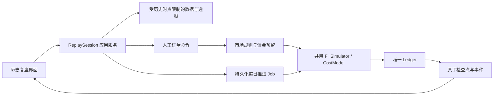

# 历史选股与手动模拟交易设计

版本：0.1。日期：2026-09-12。状态：Proposed，待实施。已纳入主需求与 OpenAPI（2026-09-13，RP-00）：REPLAY-01..10 与 RP-AC-01..14 进入 `docs/requirements.md`，ReplayConfig/ReplaySession/SessionCommand/ManualOrder 等 DTO 与 `/replay-sessions*` 端点已写入 `docs/api/build_openapi.py`。

用户已明确选择：**手动复盘——逐日推进历史，在界面自己决定买卖。** 本文延续当前文档设计任务，不代表页面、接口、撮合或账本已经实现；不修改现有 OpenAPI 和业务代码。

## 1. 产品定位

用户创建一个历史复盘会话，选择历史起点与数据快照。系统只展示该会话当前时刻已经可知的行情、财务、因子和股票状态；用户运行选股、查看个股、决定买入或卖出，再点击“下一交易日”，查看模拟成交及账户变化。

核心流程：

**创建会话 → 看截至当前历史时点的数据 → 选股 → 手动提交买卖委托 → 下一交易日 → 模拟成交、结算与估值 → 继续决策 → 结束并复盘。**

这是一种使用历史行情的交互式交易练习。自动策略回测继续沿用 [M2 设计](implementation/m2-research-loop.md)，实时行情下的模拟盘和真实账户交易仍是其他功能，不因本需求自动纳入范围。

### 1.1 首期范围

| 编号 | 能力 | 交付目标 |
| --- | --- | --- |
| REPLAY-01 | 历史会话 | 固定快照、历史股票母池、起止区间、时区、初始资金与模型版本 |
| REPLAY-02 | 逐日推进 | 手动前进一个交易日，停在确定的日终决策时点，不自动快进 |
| REPLAY-03 | 历史选股 | 使用当前会话 as_of 执行选股方案，查看排序、数据时间与入选原因 |
| REPLAY-04 | 人工交易 | 用户明确选择买卖方向、数量、订单类型、限价和有效期；支持撤销未成交数量 |
| REPLAY-05 | 成交模拟 | 市场资格、成交时序、费用、滑点、成交量约束、部分成交和拒单 |
| REPLAY-06 | 账户状态 | 现金、冻结资金、可用资金、持仓、可卖数量、成本、费用和盈亏 |
| REPLAY-07 | 操作证据 | 每次选股、下单、撤单、推进、成交与笔记形成可追溯日志 |
| REPLAY-08 | 会话恢复 | 离开页面后再次打开可继续；服务重启不重复成交或丢失历史进度 |
| REPLAY-09 | 复盘报告 | 逐笔记录、净值/回撤、基准、持仓暴露、交易统计、导出 |
| REPLAY-10 | 界面闭环 | 可用鼠标和键盘完成全部操作，历史时间与当前现实时间清楚区分 |

首期设计按单市场、股票、单币种、仅做多现金账户、从空仓开始组织；这些是建议的能力范围，实际市场、场所和账户规则必须在开发前确认，不默认为某个市场的结算、交易单位或费用标准。

暂不加入分钟内手动交易、自动播放、任意时间跳转、杠杆做空、跨币种、期权、自动交易规则或外部通知。止盈止损、条件单和分支练习留作后续扩展，不能在日线数据下伪造精确盘中顺序。

## 2. 成熟项目的参考与取舍

以下是本轮核查官方文档与上游资料后的设计比较，区分已有实践和本项目选择；没有采用外部实现代码或新增运行时依赖。

| 参考 | 经核查的实践 | 本项目采用的设计 | 保持明确的差异 |
| --- | --- | --- | --- |
| TradingView Replay Trading | 历史回放中提供买卖操作、初始资金/费用配置、图上成交和交易报告；官方将其与 Paper Trading 区分 | 历史时间控制、图表与订单面板、手动交易和复盘报告 | 本项目要求会话和全部操作持久保存，恢复协议由自己明确；不照搬产品默认手数 |
| QuantConnect / LEAN | 框架区分标的选择、信号、组合、风险与执行；Fill Model 定义成交数量/价格并可结合滑点模型 | 共用历史数据、选择、市场规则、撮合、费用和账本模块 | 人工命令提供交易意图，不要求先生成自动 Alpha/目标组合；不强行让人手动下单走自动调仓 |
| Backtrader | 订单创建与成交分离；其常规 Bar 市价示例使用后续 Bar 开盘，并明确已观察的当前 Bar 不再用于新单成交 | “看到历史时点数据后下单，后续事件才可能成交”的因果约束 | 其所述基础执行逻辑未考虑成交量；本项目必须有明确流动性政策，不直接照用其简化假设 |
| RQAlpha | 模拟模块独立配置撮合方式、成交量限制、价格限制、无成交量限制和滑点模型；上游变更记录持续涉及这些边界 | 将这些市场模拟项纳入显式模型、预检和反例验收 | 不采用其默认撮合方式、参数或源码；实际市场规则与数据证据按本项目确认 |

资料：

- [TradingView 历史交易说明](https://www.tradingview.com/support/solutions/43000691889-learn-to-trade-on-historical-data/)。
- [LEAN 框架职责](https://www.quantconnect.com/docs/v2/writing-algorithms/algorithm-framework/overview)、[成交模型](https://www.quantconnect.com/docs/v2/writing-algorithms/reality-modeling/trade-fills/key-concepts)、[上游框架源码入口](https://github.com/QuantConnect/Lean/blob/master/Algorithm/QCAlgorithm.Framework.cs)。
- [Backtrader 订单创建与执行](https://www.backtrader.com/docu/order-creation-execution/order-creation-execution/)。
- [RQAlpha 模拟配置源码](https://github.com/ricequant/rqalpha/blob/master/rqalpha/mod/rqalpha_mod_sys_simulation/__init__.py)、[上游变更记录](https://github.com/ricequant/rqalpha/blob/master/CHANGELOG.rst)。

选择是：**借鉴交互与模型职责，继续使用 Go 实现本项目既定的模块化单体。** 后续如考虑引入外部代码或引擎，再独立核实版本、许可、数据授权及兼容成本；本轮的来源比较不构成引入依赖的决定。

## 3. 用户如何使用

### 3.1 创建复盘会话

必须明确配置：

- 会话名称、固定数据快照、历史 UniverseVersion、起止交易日期和市场时区。
- 每日停留的决策时点政策、预热历史长度、严格 PIT 或显式探索模式。
- 初始现金及币种、MarketRules、FillModel、CostModel、估值/指标政策及参数。
- 允许的订单类型和有效期、资金预留/不足处理政策、期末处理规则、基准。

不需要填写自动买卖策略，也不强制填写训练/验证/测试切分；人工练习报告单独标识为“手动历史复盘”。缺少真实市场和模型决策时，页面可展示配置需求，但不能用零手续费或通用规则冒充完整仿真。

起点是首个供用户决策的历史日终时点。可看此前预热数据，但起点以前不产生交易。会话当前时点不得晚于最后可用数据所覆盖的决策点；结束日期包含在复盘交易日列表中，底层时间查询仍沿用左闭右开区间。

### 3.2 在历史当天选股

用户点击“按当前日期选股”，选择已保存的 ScreenerVersion。服务端从会话读取 snapshot、universe、current_as_of；浏览器不能改为未来时点。

结果复用 [选股设计](stock-screening-design.md) 中的三值逻辑、稳定排序、评分、缺失说明和解释。每次筛选记录方案版本、会话 revision 和选股时点；用户可以在当天切换方案，但试验记录必须保留。

进入下一日后，旧名单仍可查看，并标示其所属日期。旧名单不会自动触发交易；新订单的价格展示、可交易性和资金校验按当前会话状态重新获取，不能把旧筛选结果当成当前报价。

### 3.3 手动买卖

选中股票后可查看截至当前时点的 K 线、历史估值和因子、入选解释及已有持仓。点击买入/卖出打开订单表单，填写数量、订单类型、限价（适用时）和有效期。

提交后显示“委托已受理，等待后续行情”，不立即把持仓视为成交。首期只支持买卖数量输入；按金额/目标权重下单以后再增加并明确舍入和缺口处理。支持用户交易母池内未被选股条件选中的股票，记录来源为 manual；持仓股票即使后来退出母池也保留行情、估值和减仓操作，不能随名单变化被删除。

撤单只能影响尚未成交的余量，不能撤回历史成交。改价/改量首期通过撤销余量后提交新订单完成，保留两者关系。未成交委托列表显示未成交原因、冻结资金/数量和有效期。

### 3.4 下一交易日

用户点击“下一交易日”，系统锁定当前会话 revision，顺序回放到下一个日终决策时点。中间所有公司行为、订单有效期、市场撮合、结算与估值事件都按模型处理，然后一次展示新日期、成交回报和账户状态。

推进期间不允许新增委托、撤单或再发起推进；客户端显示进行中并保留当前已提交状态。刷新页面读取同一个任务；网络重试不能多前进一天。

首期以“完整交易日”为操作粒度。用户看不到该日中途情况，也不能在已回放完的一天里插入盘中订单。如需根据盘中价格手动决策，应另行支持分钟或逐笔回放并具备相应数据。

## 4. 核心时间与成交约束

### 4.1 历史数据可见性

1. 决策、图表、因子、财务、证券名称、行业、成分和交易状态都受 `available_at <= current_as_of` 与历史有效性约束。
2. 系统内部模拟器可以在推进过程中读取待回放事件，但在提交新时点前不得将这些未来事件、成交结果或价格泄露给页面、选股或下单预览。
3. 日 K 必须已经结束并在当前时点可用；只有发布日期的财务数据需使用已版本化的可用性政策。不能通过日终显示自动假定同日财报早已公开。
4. 复盘接口只允许有界的过去查询；未来行情、未来标的名单、未来分析标签和预测收益不能仅在 CSS 中隐藏，服务端不应返回。
5. 缓存键含 session_id、snapshot hash、current_as_of、session_revision、字段及计算版本，避免切换会话/日期后复用未来缓存。
6. 前端图表不预加载整个未来区间；自动缩放、指标、悬浮提示和收益统计也只能使用当前可见数据。

会话内可以防止系统泄露未来，但用户可能曾在其他工具或该项目的研究页面看过历史走势。因此不能宣称人工练习一定是未见样本；报告保留模式、会话次数和操作历史，不能把人工结果包装成严格样本外策略证明。

### 4.2 日线交互的基准流程

以下是日终手动决策模式的设计约束；具体交易日历、可卖时间、费用和价格限制仍由选定市场模型确定。

```text
历史交易日 D 的决策时点：
  展示已经可用的 D 及以前的数据
  用户运行选股，提交买单/卖单或撤单
  委托进入 pending，尚未增加成交持仓

点击“下一交易日”：
  回放 (D 决策时点, D+1 决策时点] 的事件
  先处理该事件之前已提交且已生效的订单
  按成交事实更新费用、现金、持仓、结算与估值

历史交易日 D+1 的决策时点：
  原子发布新状态，展示成交和未成交原因
  用户基于新可见数据再次决定买卖
```

新订单不能成交在用户已经看到的 D 日收盘价；下一交易日开盘只是支持的成交候选规则，不保证成交，更不能保证等于前一日收盘价。停牌、涨跌限制、无成交量、资金不足、过期或价格未触及都可能不成交。

对日线数据，只有最终 OHLCV，缺少实际盘中路径。若模型按下一 Bar 开盘并参考整日成交量限制数量，这属于粗粒度 Bar 仿真假设；报告必须披露，不能声称复原真实开盘流动性。更精确的集合竞价/分钟成交需要对应数据，不能从全天成交量推断出来。

### 4.3 订单与资金

| 项目 | 要求 |
| --- | --- |
| 订单类型 | 首期市价单、限价单；仅启用 MarketRules + FillModel 共同支持的能力 |
| 有效期 | 必须显式选择；DAY 定义为订单下一有效交易时段结束，GTC 由模型支持并受会话末端规则约束 |
| 限价成交 | 依据后续 Bar 与价格政策判断；仅触及不能无条件保证足额；成交价不得违反限价约束 |
| 市价跳空 | 成交前重新校验可用资金，按显式 insufficient_cash_policy 部分成交或拒绝余量，不能透支 |
| 资金预留 | 下单时按有版本的 reservation policy 预留费用及资金；市价估算不能被当成成交承诺 |
| 卖出预留 | 预留可卖数量；重复卖单不能重复使用同一份可卖库存 |
| 多订单竞争 | 固定生效时间、提交序号和订单 ID 排序；不得按事后结果挑选更有利执行次序 |
| 买卖资金衔接 | 卖单尚未成交或结算政策尚不允许使用的资金，不提前用于买单；同日可复用性由市场模型决定 |
| 流动性 | 同股票、同 Bar 的所有委托共享成交量额度，不能每笔分别拿一份完整额度 |
| 费用 | 佣金、税费、最小收费、方向差异及生效区间由版本模型定义，不能每次部分成交随意重复计最低费 |
| 成交事实 | Fill ID 幂等；相同 ID 不同内容为冲突，不能重复记账或悄悄覆盖 |

订单状态至少覆盖 accepted、partially_filled、filled、cancelled、expired、rejected，另保留拒绝/未成交原因。取消后的部分成交仍保留，订单累计成交量不得超过原委托量。该订单状态与现有研究 Job 状态分开建模。

## 5. 账户、持仓与会话结束

每个 ReplaySession 拥有独立模拟账户，初始现金配置后不可原地修改；初始配置变化创建新会话。首期不支持模拟外部出入金，不与自动回测或其他会话共享现金和持仓。

Ledger 是唯一账户写入者，页面不能提交“成交价”“成交时间”或“当前资产”作为事实。账户至少展示：

- 账面现金、订单冻结、其他不可用资金、可用资金；这些项按账户模型解释，不直接假设可用资金等于现金。
- 股票数量、可卖数量、卖单冻结、成本基础、估值价格及其时点。
- 已实现盈亏、未实现盈亏、分红/其他现金权益、累计费用、净资产。
- 当前估值完整性、缺价/陈旧价格警示及其对指标的影响。

分红、拆并股、退市等公司行为按事件模型处理；账本用原始交易价格和公司行为，图表复权不能再给账本重复计收益。退出选股母池或当日未入选不触发自动卖出，不得删除持仓。

停牌/缺价时不把资产归零，也不静默无限沿用旧价。配置明确的 stale valuation policy；无法估值时区分“交易和数量事实可保存”与“权益及相关指标不可用”，报告用 null + reason，不展示伪精确净值。

结束会话包括用户提前结束与抵达设定末端：

1. 不再接受新的委托，按固定会话终止政策取消尚未成交余量并释放预留。
2. 保留最后真实持仓、估值和未实现盈亏；首期不按已知最后收盘价强制平仓。
3. 发布报告并冻结会话终态。若用户希望实际模拟卖出，应在尚有后续行情时提交卖单并推进。
4. 当前已是最后决策时点时，禁止提交需要未来行情才能执行的新单，提示结束或创建延长区间的新会话；不能修改原会话的冻结数据范围。

## 6. 会话、命令与任务模型

### 6.1 核心对象

| 对象 | 字段与职责 |
| --- | --- |
| ReplayConfig | snapshot_id、universe_ref、区间、日历/时区、日终决策政策、预热、初始现金、市场/撮合/费用/预留/估值/指标模型及参数、严格模式、基准 |
| ReplaySession | id、config hash、当前 as_of、revision、状态、账户/检查点引用、结束原因 |
| ReplayCommand | command_id、session_id、expected_revision、kind、输入、现实提交时间、历史决策时间、可选选股/笔记引用 |
| ReplayStep | step_id、from/to、起始 revision、Job ID、事件范围、checkpoint hash、结果摘要 |
| ManualOrder | ID、session/command、证券、方向、数量、类型、限价、TIF、生效时刻、累计成交及冻结信息 |
| ReplayEvent | session_id、单调序号、历史时刻、事件类型、关联命令/订单/成交/日记账 |
| ReplayReport | 已推进区间、成交/持仓/费用、指标政策、操作日志、限制说明和产物清单 |

现实 submitted_at 用于审计和并发，历史 decision_at 由服务端当前会话确定；浏览器只能提交 expected_revision，不能伪造历史下单时间。

### 6.2 状态与推进事务

会话状态建议为 `initializing → awaiting_action → advancing → awaiting_action`，另有 `closing → completed` 与 `failed`。页面离开时只要处于 awaiting_action，就自然停在当前历史时间，无需添加一个长期运行的“暂停 Job”。

准备、每日推进、会话结束与导出使用短生命周期的既有 Job；ReplaySession 可以跨越多次 Job 和多个现实日。用户等待不应占用一个 Worker 租约。浏览器离开时已受理的单次推进继续完成，随后等待用户。

所有改变订单、账户、会话时间的命令以 session_id 串行化，带 Idempotency-Key 和 expected_revision：

- 相同命令重试返回已记录的结果，不重复下单或推进。
- 不同命令竞争同一 revision，仅一个成功，其余返回 409 session_conflict，页面刷新当前状态。
- 推进受理即锁定会话，advance 和 cancel-order 不能同时作用于同一个正在模拟的日段。
- 选股可以异步读取固定时点，但结果始终携带源 revision；若会话已推进，只作为旧日期结果展示，不自动替换当前名单。

每个交易日从最近已提交 checkpoint 开始，在隔离状态中模拟，暂存结果和产物；提交时检查 fencing token、expected revision 与取消状态，原子使下一个 checkpoint、订单/成交/账本、session.current_as_of/revision 和事件引用可见。逐日过程不向外暴露半天状态。

崩溃发生在提交前，可以废弃本次未发布计算并从原 checkpoint 重算；发生在提交后，恢复为已完成推进。这里不撤销任何已提交成交，也不把页面回退当成账本回滚。大产物仍遵守“暂存→校验→内容寻址文件→元数据引用”的现有发布协议。

用户取消推进任务时：若取消先于日段提交受理，停止未发布计算并恢复原 awaiting_action 检查点；若提交先完成则返回已完成结果/冲突，不能撤回该日成交。不可恢复故障保留证据并标记 failed，不丢弃整个会话历史。

### 6.3 回看与重新练习

首期允许只读查看此前的选股、订单和成交，不能把 current_as_of 向后移动后覆盖原账户。重新练习创建新会话并关联来源，保存尝试次数及已经看过的历史范围提示；不宣称新会话是未看过走势的独立样本。

真正的中途 fork/checkpoint 分支是后续能力，必须保存父会话、分支点和决策日志，不以“撤销交易”伪装删除历史。

## 7. Go 模块和接口建议

不新增另一套回测撮合核心。建议在共用 MarketRules、FillSimulator、CostModel、Ledger、DataView 之上增加 ReplaySession 应用层；人工命令经过与自动订单相同的市场、资金和账本边界。



候选签名仅用于设计，不是当前 Go 包已有实现：

```go
type ReplayService interface {
    Preflight(ctx context.Context, cfg ReplayConfig) (ReplayPreflight, error)
    Create(ctx context.Context, cfg ReplayConfig, key string) (Job, error)
    Get(ctx context.Context, sessionID ID) (ReplaySession, error)
    SubmitOrder(ctx context.Context, cmd ManualOrderCommand) (OrderReceipt, error)
    CancelOrder(ctx context.Context, cmd CancelOrderCommand) (OrderReceipt, error)
    AdvanceOneDay(ctx context.Context, cmd SessionCommand) (Job, error)
    Close(ctx context.Context, cmd SessionCommand) (Job, error)
}

type ReplayReader interface {
    QueryHistory(ctx context.Context, sessionID ID, q ReplayDataQuery) (DataPage, error)
    Account(ctx context.Context, sessionID ID) (AccountSnapshot, error)
    ListOrders(ctx context.Context, q ReplayOrderQuery) (OrderPage, error)
    ListEvents(ctx context.Context, q ReplayEventQuery) (ReplayEventPage, error)
    Report(ctx context.Context, sessionID ID) (ReplayReport, error)
}
```

`SessionCommand` 携带 session_id、expected_revision、command_id/幂等键；订单命令额外携带人工指定交易字段，不包含可由客户端决定的 Fill。ReplayDataQuery 的上界由会话服务校验。CheckpointStore 是持久化端口，只允许持有有效租约的日段执行器提交。

共用模拟核心仅接收事件、合法订单和冻结模型，不感知浏览器按钮或实时系统时钟。未来自动回测可以通过另一种决策输入复用它，但本需求不强制实现自动 Alpha、策略调仓或真实券商接口。

## 8. HTTP 接口建议与兼容性

以下路径拟使用 `/api/v1` 前缀，尚未加入 OpenAPI。实现时应一次明确 DTO、错误、分页、权限、幂等、类型生成及契约测试。

| 方法 | 相对路径 | 输入与结果 |
| --- | --- | --- |
| POST | `/replay-sessions/preflight` | ReplayConfig → valid、issues、覆盖与模型能力，不创建任务 |
| POST | `/replay-sessions` | ReplayConfig → 202 Job，预分配 session_id |
| GET | `/replay-sessions` | 分页列出当前工作区会话与状态 |
| GET | `/replay-sessions/{id}` | 冻结配置、current_as_of、revision、账户/任务引用 |
| POST | `/replay-sessions/{id}/data/query` | 字段/证券/历史范围/游标 → 已截断至会话时点的数据 |
| POST | `/replay-sessions/{id}/screens` | screener_ref、expected_revision → 202 Job；快照、母池和 as_of 由会话固定 |
| GET | `/replay-sessions/{id}/screens/{screen_run_id}` | 该次选股上下文、分页结果入口与解释引用 |
| POST | `/replay-sessions/{id}/orders` | expected_revision、证券、方向、数量、类型、限价、TIF → 201 订单回执 |
| GET | `/replay-sessions/{id}/orders` | 按状态分页查询；成交量与剩余量、拒单原因 |
| POST | `/replay-sessions/{id}/orders/{order_id}/cancel` | expected_revision → 撤单回执，保留已成交数量 |
| POST | `/replay-sessions/{id}/advance` | expected_revision → 202 日段 Job，只推进一个交易日 |
| GET | `/replay-sessions/{id}/account` | 当前提交状态下现金、冻结、持仓与估值完整性 |
| GET | `/replay-sessions/{id}/events` | 按单调序号分页读取会话事件及成交/账本引用 |
| POST | `/replay-sessions/{id}/notes` | 当前历史时点的文本笔记 → 新笔记记录，追加不覆盖审计 |
| POST | `/replay-sessions/{id}/close` | expected_revision → 202 结束任务，取消余单、估值并发布报告 |
| GET | `/replay-sessions/{id}/report` | 当前已推进区间的预览或最终报告，明确 is_final |
| POST | `/replay-sessions/{id}/exports` | 选择订单/成交/账本/报告及格式 → 202 导出 Job |

接口细节要求：

- 写操作与现有 API 共用 Idempotency-Key、认证、工作区隔离、request_id；data/query 与 preflight 是只读 POST。
- 服务端在执行具体会话命令前检查 expected_revision 和状态；不能仅依据用户登录授权忽略会话时间边界。
- Job 进度和 SSE 复用既有 `/jobs/{id}`，会话事件是独立的持久化业务日志，不能拿有窗口上限的 Job SSE 代替完整交易历史。
- 资源不存在/不属于会话返回 404；会话推进冲突或状态不允许操作返回 409；结构错误 400；未来查询、缺少模型/数据、禁止卖出或无未来行情等业务预检返回 422。采用项目统一业务码与 Issue 字段，不在 handler 另设错误格式。
- 订单受理后发生市场拒单时，订单记录保留 rejected 状态和原因；提交请求本身非法则返回 422，保留命令审计，不产生有效订单。
- 分页游标绑定工作区、会话、已提交 revision/结果集、筛选与稳定排序，状态变化导致失配时明确要求重查。
- 输出中的金额、价格、数量使用 Decimal 字符串，统计缺失使用 null + reason，不在浏览器进行正式记账。

### 8.1 对现有契约的影响

当前 BacktestCreate 要求 StrategyVersion 和 ValidationSplit。人工会话不具备自动策略输入，不能塞假策略或虚构切分来复用该 DTO；新增 ReplayConfig，复用内部模型和报告能力即可。

Job.result_refs 和运行记录如需要新增 replay_session/replay_step 类型，应显式修改生成源、持久化约束、Go 映射、TypeScript 与消费者；数据库迁移编号在实施时分配。首期复盘会话单独列出，不把 Experiment.kind 静默扩充为旧客户端不能处理的类型。

原选股设计的只读 ScreenRun 可被会话引用，但会话接口必须验证其 snapshot、as_of、母池及来源一致性；不允许通过任意 screen_run_id 注入未来名单。选股、订单、账户和报告的关联检查均由服务端执行。

首期不增加实盘路由、券商凭据或外部下单能力。历史模拟账户 ID 具有独立类型/命名空间，避免后来误传入实盘接口。

## 9. 界面设计

沿用 [现有界面约定](frontend.md) 和 [设计方向](../DESIGN.md)，新增“历史复盘”入口。以下为页面需求，不是已实现界面。

### 9.1 主界面布局

```text
会话名 | 历史时刻与时区 | 数据快照 | 阶段/质量提示 | 下一交易日 | 结束复盘
----------------------------------------------------------------------------
历史选股 / 关注列表        个股 K 线与截至当前时点的数据       手动委托
条件、排名、选股日期       指标、财务、成交标记               买入/卖出
入选与排除原因             可见区间截止线                     数量/类型/限价/TIF
----------------------------------------------------------------------------
资金与持仓 | 未成交委托 | 成交记录 | 操作与笔记 | 净值/回撤
```

“历史时刻”固定显著显示，订单表单说明最早可能成交的后续时段。现实时间仅用于日志，不能把今日实时报价混进回放 K 线、报价栏或盈亏。

点击股票切换图表不改变会话时点。持仓列表始终可见，即使该股票不在当日选股结果里。账户数字与图表用相同已提交 revision，不能展示新一天价格配旧一天资产。

### 9.2 操作反馈与异常

- 下单前显示估算资金/费用及其参考价格时点，明确只是估算；成功反馈为“委托已受理”，真正成交在推进后显示。
- 推进按钮忙碌时锁定重复操作；跨标签页冲突显示“会话已变化，请刷新状态”，不默默重发交易。
- 数据缺口导致无法推进时展示具体日期/字段；首期不得跳过缺失交易日并当作完整回放。
- 无选股结果时仍能查看账户与历史数据；不自动放宽条件、不强制清仓。
- 撤单只列出可撤余量；撤单失败刷新订单事实，不能先从列表删除后补错误。
- 离开页面无须确认“暂停行情”，但未提交的订单表单需要草稿提示；订单草稿不等于已经受理。
- 结束会话确认框说明取消余单、保留持仓和冻结报告，不写成“全部卖出”。
- 支持键盘选择、中文输入法、字段错误聚焦、可见焦点和窄屏顺序面板。状态、买卖与盈亏不用颜色单独表达。

## 10. 复盘报告与研究边界

运行中只显示已推进区间的统计，结束后冻结最终报告。至少包含：

- 初始/期末权益、现金与持仓、已实现/未实现盈亏、分红及费用明细。
- 净值、回撤、基准、持仓集中度、持仓周期和交易次数。
- 委托与成交率、拒单/过期/部分成交原因、模拟滑点、资金闲置和不可交易持仓。
- 下单前选股名单、当时指标/财务值、条件解释、人工决策笔记与每笔交易的关联。
- 数据快照、可用时间/估值/费用/撮合政策、构建与检查点哈希，以及所有近似假设。
- 练习会话及来源关系、是否重做过同一区间、人工模式标记。

胜率和盈亏比必须固定开平仓配对及成本分摊方法；仍未平仓不能伪装成获胜交易。样本太短或零分母时指标返回 null。无交易会话仍可结束并保留现金路径，相关交易指标标记不适用。

人工结果可以与同区间同币种同口径基准比较，但不能直接归入“已通过样本外验证”的自动策略排行。把人工决策整理成自动规则，是另一个需要重新验证的研究步骤。

## 11. 数据准备与实施顺序

### 11.1 必要数据

基础：历史证券主数据/退市记录、交易日历和时段、原始 OHLCV/成交额、历史状态与价格限制、交易单位、公司行为、估值与结算所需参数、同币种基准。按使用的选股条件增加 PE/PB、市值、股本、财报与历史披露/修订数据。

具体字段沿用 [数据目录](factor-data-catalog.md)。没有财务数据也可设计仅价格因子的练习，但必须显式选择相应方案；缺少必要市场交易规则不能用价格完整替代成交模型验收。

### 11.2 建议工作包

| 工作包 | 可独立验收的交付 | 依赖 |
| --- | --- | --- |
| RP-01 | ReplayConfig、Session 状态、命令/revision、历史时钟与 DTO | M0 契约和持久化；合成数据可先行 |
| RP-02 | 会话时点 DataView、K 线/字段查询、人工选股接入 | PIT、Universe 和所需因子/选股引擎 |
| RP-03 | 手动订单、资金预留、共用市场/成交/费用/账本接口 | 已确认账户与市场模型；合成账本 oracle |
| RP-04 | 逐日推进、原子检查点、租约/取消/崩溃恢复 | RP-01..03、Job 和 Artifact |
| RP-05 | 历史复盘页面及下单/推进/持仓/解释闭环 | 对应业务 API 已完成 |
| RP-06 | 结束政策、报告、交易链路与导出 | 估值/指标政策及 RP-04/05 |

本功能依赖 M2 的共用撮合与账本能力，但不必等待全部自动策略功能。可以把共用模拟核心作为同一工程切片，自动回测与人工复盘分别适配；不在两个包里重复实现成交规则。

未确认项：首期市场/数据源、真实起止范围、现金账户规则、日终可用时间、订单能力、费用/滑点/流动性/估值/资金预留政策及容量。市场无关会话与合成用例不受这些决策阻塞；真实交易仿真验收受阻塞。

## 12. 验收场景

| ID | 场景 | 通过判据 |
| --- | --- | --- |
| RP-AC-01 | 当前停在 D，查询 D+1 行情、财报、成分与导出 | 服务端拒绝未来读取，前端没有预加载未来数据 |
| RP-AC-02 | 看完 D 日数据后下买单 | 当下无成交；推进后只在模型允许的后续事件成交 |
| RP-AC-03 | 下一日跳空、限价未触及、停牌或零成交量 | 资金复核、未成交/拒单符合模型，不强制按昨收成交 |
| RP-AC-04 | 多买单抢资金、多卖单抢库存、多单共享成交量 | 无透支/超卖/重复额度，执行次序固定 |
| RP-AC-05 | 部分成交后撤单、DAY 过期、重复 Fill | 保留已成交事实、释放余量预留，账本不重复写入 |
| RP-AC-06 | 连点下一日、两标签页下单与推进竞争 | 幂等和 revision 保证仅一次推进/命令生效，冲突明确 |
| RP-AC-07 | 日段提交前/后崩溃，旧 Worker 恢复或取消竞争 | 从准确检查点恢复，不丢成交、不重复发布、不回滚已提交日段 |
| RP-AC-08 | 分红、拆股、退出母池、停牌缺价 | 持仓和现金正确，复权不双计，缺估值有显式状态 |
| RP-AC-09 | 下单来自已过期筛选、未来筛选或其他会话 | 未来/跨会话引用拒绝；旧名单以当前市场和资金状态重新校验 |
| RP-AC-10 | 到期仍持仓/有余单、最后时点下新单 | 结束取消余单并保留持仓，不用最后已知价伪造平仓 |
| RP-AC-11 | 相同冻结输入和人工命令日志重放 | 名单、订单、成交、账本、检查点一致，指标符合政策容差 |
| RP-AC-12 | 页面刷新、离开、断线、重连、空名单及无交易 | 可恢复同会话，历史时间清晰，空结果与未成交原因可理解 |
| RP-AC-13 | 查别人会话的订单、解释或下载 | 工作区/会话权限一致，ID 不能绕过归属校验 |
| RP-AC-14 | 完成复盘后重新练习同一区间 | 新会话留来源与尝试证据，旧结果不可改，不宣称未见样本 |

本轮新增 REPLAY/RP/RP-AC ID 仅存在于设计提案。正式开发时同步主需求、实施矩阵、OpenAPI 生成链、迁移与测试；上述场景尚未实施验证。
