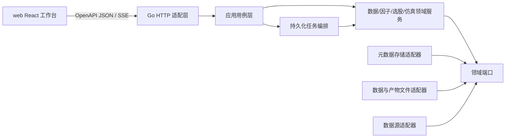

# 策略研究平台实施总纲

版本：0.2，2026-09-12。状态：Active。本文将现有需求、领域接口、HTTP 契约、数据目录和界面设计转化为可分批交付的工程计划。阶段状态以本节快照和验证记录为准；设计中出现接口或页面不等于已经实现。

## 1. 实施依据与优先级

实施时按以下顺序解释冲突：

1. [需求说明](../requirements.md) 中的产品边界、需求 ID、验收 ID 和待确认决策。
2. [接口契约](../interfaces.md) 中的领域职责、任务语义、HTTP 约定和恢复要求。
3. [OpenAPI](../api/openapi.json) 中的传输字段、必填项和响应结构。
4. [数据与因子目录](../factor-data-catalog.md) 中的数据语义、单位、PIT 与修订要求。
5. [界面需求](../frontend.md) 和 [视觉方向](../../DESIGN.md) 中的用户流程与交互状态。
6. 已接受并纳入主需求/契约的增量设计；当前 [选股设计](../stock-screening-design.md) 与 [历史手动复盘设计](../historical-replay-trading-design.md) 仍为 Proposed，先作为待接入设计来源。
7. 本目录的工作包、包结构建议和验证方法。

若实现发现这些来源互相矛盾，先修订正式契约并记录决策，不在代码里做隐式兼容。`docs/contracts/contracts.go` 是扩展端口草案，不直接复制成持久化模型或 HTTP DTO。

## 2. 交付边界

首期目标是研究闭环：数据接入与快照 → 历史标的池 → 因子计算 → 选股 → 策略版本/手动历史复盘 → 回测与报告 → 对比和导出。选股产生候选名单，不直接产生订单；手动历史复盘使用历史数据和独立模拟账户，不是实时模拟盘或实盘交易。

实时模拟或实盘交易仍属于 M4。未完成独立账户、场所、风控、对账和恢复设计前，不得将 ReplaySession、Backtest Run 或研究 Job 接入真实账户。

当前市场、供应商、团队部署、模型与成果格式等决策见 [决策与门禁](decisions-and-gates.md)。DEC-03 已批准 M0 单机 SQLite 假设，但 M1 的容量/部署目标仍待最终确认。实现不得用 A 股、日线、零费用、当前成分或任意示例供应商替代未决项。

M0 不依赖市场决策。当前 M0-01..08 已交付并合入 main，统一验证入口通过，`GATE-M0-DONE` 定级待 Integrator 确认。M1 的真实数据源、M2 的真实市场仿真以及 M2R 手动复盘的订单/账户部分受相应门禁约束。

选股的纯规则切片可用合成数据先行；完整 ScreenRun 依赖 M1 DataView、Universe 与 Factor。ReplaySession 的配置、revision 和历史时钟可用合成数据先行；实际订单推进依赖与自动回测共用、已版本化并通过账本 oracle 的市场仿真核心。

## 3. 目标架构与依赖方向



强制规则：

- 传输 DTO、应用命令、领域对象、持久化记录分别定义并显式映射。
- 领域和应用包不引用 HTTP、数据库驱动、供应商 SDK 或前端生成代码。
- 数据源只产生带来源证据的原始页；标准化、质量检查、写入和快照发布由应用流程编排。
- 策略只能读取绑定 `snapshot_id + as_of` 的 `DataView`，不能访问网络、数据库或系统时钟。
- `Ledger` 是现金、持仓和权益的唯一写入边界；报告不反向修正账本。
- Job 状态和研究 Run 分开：Job 可重试，Run 输入与终态证据不可原地覆盖。
- ReplaySession 跨越多个短 Job；人工订单状态和完整 ReplayEvent 是业务事实，不能用有窗口上限的 Job SSE 代替。
- 选股与手动复盘的所有历史数据都受服务端 `snapshot + as_of` 约束；前端不得预加载未来数据后仅用样式隐藏。
- 元数据事务与文件发布采用“同卷暂存 → 校验 → 原子改名到内容寻址位置 → 元数据事务使引用可见”的协议；事务前崩溃最多留下不可查询的孤儿文件，不能留下指向缺失文件的成功记录。

## 4. 建议源码布局

Go module 已确定为 `github.com/injoyai/strategy`，最低 Go 版本及依赖锁定见 `go.mod` 与 ADR。目录职责如下，具体包随纵向切片增加，禁止为目录而目录：

```text
cmd/researchd/                 HTTP 服务与内嵌 Worker 进程入口
internal/app/                  用例、事务边界、DTO 到领域命令映射
internal/domain/               值对象、状态机、数据/因子/回测规则
internal/ports/                存储、时钟、ID、数据源、产物等端口
internal/server/               OpenAPI handler、认证、SSE、错误映射
internal/store/                SQLite 元数据与迁移
internal/artifacts/            内容寻址文件、校验与隔离
internal/synthetic/            synthetic provider、normalizer 与质量规则
internal/data/                 Batch、Snapshot 与 PIT DataView
internal/jobs/                 租约、fencing、取消、恢复与 Worker
internal/screening/            选股规则、排序、解释与编排（计划）
internal/replay/               ReplaySession、人工命令与逐日推进（计划）
internal/store/migrations/     单向、带校验和的元数据迁移
web/                           React + TypeScript + Vite 工作台
testdata/                      小型确定性样本、PIT 与手算账本 oracle
docs/adr/                      已批准的架构与依赖决策
```

服务首期可以是一个 `researchd` 二进制中的 HTTP 与 Worker 两个组件，但它们必须通过持久化 Job 协作，测试中能分别启动/停止。拆分进程时不改变应用命令和 HTTP 契约。

## 5. 阶段与可交付切片

| 阶段 | 可独立验收的纵向切片 | 退出门禁 |
| --- | --- | --- |
| M0 契约与基础 | 合成数据更新 → Job 恢复 → 批次/质量 → 发布快照 → 页面查看 | `GATE-M0-DONE`：契约生成、迁移、幂等/取消/恢复、合成流程和最小浏览器流程通过 |
| M1 数据与因子 | 已决策真实数据 → 标准化/PIT → 历史标的池 → 价格类因子 → 因子分析页面 | `GATE-M1-DONE`：AC-01..05、真实源样本与字段/单位/权限证据通过 |
| M1S 选股 | 方案版本 → 三值条件 → 稳定排序/评分 → ScreenRun/解释 → 静态池/导出 | `GATE-SCREEN-DONE`：SCREEN-01..08 与 SC-AC-01..12 通过；真实字段验收仍受 M1 门禁约束 |
| M2 研究闭环 | 策略版本 → 回测预检 → 确定性成交/账本 → 报告/对比/导出 | `GATE-M2-DONE`：AC-06..10、手算账本、重跑一致和界面闭环通过 |
| M2R 手动历史复盘 | 冻结会话 → 当日选股/人工订单 → 单日原子推进 → 账户/报告/恢复 | `GATE-REPLAY-DONE`：REPLAY-01..10 与 RP-AC-01..14 通过；不等于 M4 准入 |
| M3 研究增强 | 财务/估值与更多因子 → 滚动验证 → 参数批量实验 | `GATE-M3-DONE`：AC-11、泄漏防护、全部尝试可追溯和压力场景通过 |
| M4 交易接入 | 独立设计后实施模拟/实盘适配 | 新的账户与交易架构、风险和准入验收批准；不在本实施基线内 |

任何阶段只在“代码 + 测试 + 配置/迁移 + 契约 + 用户文档 + 可复现实证”同时完成后退出。仅有 handler、页面或 happy path 不构成完成。

## 6. 文档导航

| 文档 | 用途 |
| --- | --- |
| [决策与门禁](decisions-and-gates.md) | 阻塞项、工程决策、开始/退出条件 |
| [M0 工程基础实施](m0-foundation.md) | 骨架、任务、存储、契约、合成纵向切片 |
| [M1 数据与因子实施](m1-data-factor.md) | 拉取、标准化、质量、快照、PIT、标的池和因子 |
| [M1S 选股实施](m1-screening.md) | 选股契约、三值逻辑、稳定排名、结果解释和静态池衔接 |
| [M2 研究闭环实施](m2-research-loop.md) | 策略、回测、账本、报告、实验和导出 |
| [M2R 手动历史复盘实施](m2-manual-replay.md) | ReplaySession、人工订单、逐日检查点、账户和复盘报告 |
| [M3/M4 扩展边界](m3-m4-extension.md) | 研究增强工作包与交易接入启动前设计门禁 |
| [前端实施](frontend-delivery.md) | 路由、状态、SSE、共用组件和浏览器验收 |
| [验证与追踪](verification-and-traceability.md) | 需求到工作包/测试映射、CI 层次与完成定义 |
| [多 Agent 并发交付](multi-agent-delivery.md) | Work Order、文件所有权、并发波次、合并与验证责任 |

## 7. 执行约定

- 每个工作包开始前确认依赖门禁与契约；结束时记录实现提交、迁移版本、测试命令和证据位置。
- 多 Agent 开发按 [并发交付规范](multi-agent-delivery.md) 执行；共享契约、migration、依赖、全局接线和最终状态由单一 Owner 串行维护。
- 所有写 API 使用 `Idempotency-Key`；只读 POST 按接口契约例外。服务端不能依赖前端防重复点击。
- 强制更新必须调用上游并形成新批次证据，即使缓存已最新；内容可按校验和去重，但请求事实不能丢失。
- 所有时间区间左闭右开；对外时间带时区。金额、价格、数量使用十进制；统计缺失返回 `null + missing_reason`。
- 发布版本和终态结果不可原地修改。归档只是可见性变化，不破坏引用。
- 未知市场能力、单位、PIT 证据、模型或指标口径一律 fail closed，并返回可定位 Issue。
- Proposed 设计的 ID、端点和 DTO 必须先进入主需求、OpenAPI 生成链、Go/TS 类型与契约测试，不能把设计示例当作已支持接口。
- 新增生产依赖先做最小兼容性验证并记录 ADR；不得只因文档示例而引入。
