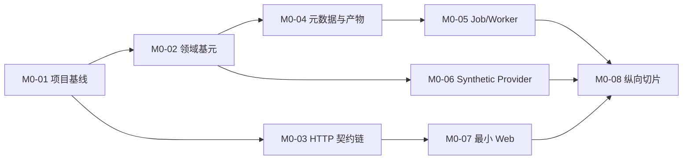

# M0 契约与工程基础实施

目标：在不选择具体市场和真实供应商的前提下，交付可启动、可恢复、可审计的最小纵向切片。完成后可以从浏览器提交 synthetic 数据更新，观察持久化 Job，查看批次质量并发布不可变快照。

状态快照（2026-09-12）：M0-01..08 已在 `m0-foundation` 分支交付——后端契约/迁移链、Job 生命周期与租约/fencing 恢复、synthetic 数据面、批次/质量/快照流水线、受限导入边界（受限上传、checksum、schema 探测、错误行报告），以及 `/connections`、`/data`、`/jobs` 最小页面均已合入。统一验证入口 `scripts/verify.ps1` 在集成基线上通过（gofmt、go vet、go test ./...、OpenAPI 生成与契约检查、前端 typecheck/build 与 vitest）；`TestM0VerticalSliceAcceptance` 经真实 HTTP mux 与 `jobs.Loop` 走通 synthetic 更新 → 入库 → SSE 恢复 → 批次/质量 → 故障重试 → 严格 PIT 快照 → 重启持久化。以上构成 `GATE-M0-DONE` 五项判据的工程证据，门禁是否通过由 Integrator 依据统一验证确认；真实数据/PIT 与供应商探测仍属 `GATE-M1-START`（见 `m1-data-factor.md`）。以下章节作为既有实现约束与验收参照保留，不把局部包测试当作门禁证据。

## 1. M0 不做什么

- 不实现真实供应商，不承诺任何市场历史覆盖。
- 不实现有经济含义的收益策略；synthetic 数据只验证工程契约。
- 不用内存队列、临时目录或 mock handler 代替持久化与恢复验收。
- 不实现任意 Go 代码执行、动态插件、实盘账户或订单 API。
- 不提前锁定受 DEC-01..06 影响的市场、费用、成交和指标默认值。

## 2. 工作包与顺序



### M0-01 项目基线

交付：

- 经批准的 `go.mod`、Go toolchain 约束、`cmd/researchd` 与 `internal` 骨架。
- `web/package.json`、锁文件、TypeScript 严格配置和统一脚本；依赖版本来自 IMP-08 决策。
- 配置加载优先级、开发配置样例、日志字段和优雅退出协议。
- `docs/adr/` 中记录 module path、部署假设、元数据存储和依赖选择。
- 格式化、静态检查、测试、契约生成检查和前端构建进入同一验证入口。

验收：全新 checkout 不依赖开发者全局状态即可执行文档化命令；缺配置时错误指出字段和来源，不包含 secret；进程收到取消信号后停止接收新任务并给 Worker 有界清理时间。

### M0-02 领域基元与错误

优先实现且单元测试：

- 不透明 `ID`、`VersionRef`、左闭右开 `Interval`、UTC 内部时间与显式业务时区。
- `Decimal`、`Money`、`Price`、`Quantity` 的解析、单位、舍入和溢出策略；HTTP 边界拒绝指数、NaN、Infinity 和超长输入。
- `Issue` 与稳定错误码；错误链可保留内部原因，但 HTTP 不返回堆栈或供应商秘密。
- `Clock`、`IDGenerator`、`Checksummer` 等可替换端口，测试禁止直接依赖墙上时钟或随机全局状态。
- 不可变版本引用校验：`id` 与 `version` 必须同时匹配，不回退到 latest。

验收：边界/属性测试覆盖十进制规范化、跨单位非法运算、时间区间、错误映射和版本不匹配。领域包不导入 HTTP、SQL 或供应商包。

### M0-03 OpenAPI 到服务端/前端的契约链

流程固定为：修改生成源 → 运行 `build_openapi.py` → `check_contract.py` → 生成 TypeScript 客户端与必要的服务端绑定/测试 fixture → 检查无未提交生成差异。`openapi.json` 不手改。

HTTP 外壳必须先统一实现：

- `/api/v1` 前缀、JSON/UTF-8、未知字段拒绝、请求体大小与超时限制。
- `X-Request-ID` 校验/生成并写入结构化日志和错误响应。
- Bearer 认证中间件端口；未决定部署模式时不可默认关闭认证。显式 local 模式只能绑定回环地址，并在启动日志中提示。
- `Idempotency-Key` 提取、请求规范化哈希、调用者/工作区/方法/路径作用域和 24 小时以上重放策略。
- 错误到 400/401/403/404/409/422/429/500/503 的单点映射。
- 分页 limit、cursor、稳定排序与游标过期错误的共用实现。

契约测试按 OpenAPI 遍历至少验证成功响应、标准错误、认证、未知字段、幂等冲突和 `Location`。handler 只做传输校验与映射，不包含任务状态转换或数据规则。

### M0-04 元数据、迁移和产物边界

最小元数据模型：

| 表/聚合 | 关键字段与约束 |
| --- | --- |
| schema_migrations | version 唯一、applied_at、checksum；已应用脚本内容变化时拒绝启动 |
| idempotency_records | scope、key、request_hash 唯一；response_status/body、resource_id、expires_at |
| jobs | id、run_id、kind、state、phase、progress、config_hash、lease_owner、lease_until、fencing_token、parent_job_id、timestamps、error |
| job_events | job_id + sequence 唯一、状态快照、created_at；序号在同一事务递增 |
| runs | id、kind、immutable_config、manifest_ref、terminal_state、source_run_id |
| provider/connection_versions | id、parent_id、version、schema/设置、secret_ref；不保存 secret 明文 |
| batches | id、job_id、request evidence、raw manifest、normalized manifest、quality status、checksums |
| snapshots | id、manifest_hash、quality status、policy version、published_at |
| snapshot_batches | snapshot_id + ordinal、batch_id；发布后不可变 |
| artifacts | id、media_type、size、checksum、storage_key、published_at |

所有表包含工作区边界；即便 M0 只有一个工作区，也不能把未来授权建立在可猜 ID 上。

文件协议：

1. 只在服务管理的数据根目录下生成随机暂存名，禁止把客户端路径直接拼入。
2. 流式写入并计算 SHA-256；关闭并重新读取关键头/manifest。
3. 将暂存文件在同一卷原子改名到内容寻址的最终位置；此时尚无元数据引用，API 不可发现。
4. 在一个元数据事务中保存 artifact/batch 的最终引用和业务终态，使文件可见；若事务失败，最终位置的无引用文件是可回收孤儿，绝不能提交指向缺失文件的成功记录。
5. 启动恢复优先校验数据库已引用文件；无引用文件经过配置的保留期和二次确认后进入隔离/回收流程，不在启动时直接删除。

备份必须同时涵盖数据库、WAL/日志要求、数据文件与 artifact；恢复后遍历 manifest 校验引用和 checksum。若使用 SQLite WAL，只允许本机文件系统，设置 busy timeout，并测试长读、并发写、checkpoint 与磁盘满。具体 SQLite runtime 版本须满足当前官方修复要求，不能只依赖系统自带版本。

### M0-05 Job、租约与恢复

状态机仅允许：

```text
queued -> running -> succeeded
queued -> cancelled
running -> failed
running -> cancel_requested -> cancelled|failed
```

实现规则：

- 提交 Job、预分配 Run、写首个事件和幂等响应在同一事务中完成。
- Worker 用条件更新从 `queued` 或过期 `running` 领取，递增 `fencing_token` 并设置租约；每次进度/终态提交都匹配 token。
- handler 只将 running 改为 `cancel_requested`；Worker 在安全点观察取消。成功与取消通过条件终态更新竞争，只有一个获胜。
- 重试创建新 Job，记录 `parent_job_id`，冻结原配置；不覆盖原失败记录。
- 进度支持 total 未知；进度与事件写入节流但阶段变化、取消受理和终态不得丢失。
- 事件窗口按数量/时长配置；过期 `Last-Event-ID` 返回 410。心跳不占业务 sequence。
- 默认重新执行，不声称 exactly-once。领域写入通过自然键、修订 ID、fill ID 和结果发布令牌实现幂等。

故障测试使用可控 failpoint：领取后退出、续租前退出、文件写完事务前退出、事务后响应前退出、取消与成功同时发生、旧 Worker 延迟提交、SSE 断线与窗口过期。每个用例验证数据库终态和可见 artifact，而不只验证 HTTP 状态。

### M0-06 Synthetic 与 import 适配器

Synthetic Provider 必须实现真实 Provider 契约：能力描述、分页、稳定记录 ID、覆盖区间、可配置故障/限流、修订版本和可用时间。固定 seed 与 fixture 版本，相同请求返回确定内容；`force` 仍记录新的 fetch/batch 证据。

最小数据集包含 instrument、calendar、bar，并加入以下坏数据 fixture：重复自然键、OHLC 非法、负成交量、缺交易日、未知单位、未来 `available_at`、同自然键修订。质量引擎输出 Issue 列表和发布判定，不静默修复或填零。

CSV/Parquet import 在 M0 只需建立受限上传、checksum、schema 探测和错误行报告边界；若 Parquet 生产依赖尚未批准，可先以契约测试 fixture 验证上传流程，不声称完整导入已交付。

### M0-07 最小 Web 框架

建立全局布局、路由、主题 token、生成客户端、错误/加载组件和任务订阅，具体见 [前端实施](frontend-delivery.md)。M0 只交付 `/connections`、`/data`、`/jobs` 的最小可用路径，并预留其余路由的明确“尚未实现”状态，不返回假数据。

### M0-08 纵向切片

唯一 M0 演示路径：

1. 页面查看 Synthetic Provider 能力并创建连接版本。
2. 提交数据更新，收到 202 + Job Location；离开页面后 Job 继续。
3. Worker 分页 Fetch，保存原始证据，标准化，生成质量报告和 Batch。
4. 页面断线重连后恢复 Job 事件；失败任务能以新 Job 重试。
5. 页面查看质量问题并选择合格批次发布不可变 Snapshot。
6. 数据查询绑定 Snapshot 与 `as_of`，未来可用记录不可见。
7. 重启服务后上述资源、Job 终态和下载仍存在。

## 3. M0 测试清单

| 层次 | 必须覆盖 |
| --- | --- |
| 单元 | 值对象、状态机、错误映射、请求哈希、cursor、质量规则、PIT 选择 |
| 存储集成 | 空库迁移、唯一约束、事务回滚、租约/fencing、发布原子性、备份恢复 |
| Provider 契约 | Describe/Check/Fetch、分页、取消、错误、修订、force 请求证据 |
| HTTP 契约 | OpenAPI 成功/错误、认证、幂等、分页、Location、未知字段 |
| 进程故障 | Worker 重启、旧租约、取消竞争、文件/事务崩溃点、SSE 重放/410 |
| 浏览器 | synthetic 更新→任务→质量→快照；刷新、断线、错误、键盘基本路径 |

## 4. M0 完成证据

交付记录至少包含：版本锁文件、ADR、迁移清单、OpenAPI/生成检查输出、测试与浏览器报告、synthetic fixture 版本、恢复演练记录、已知限制。未执行的测试明确标为 `Not Run`，不能以文档检查替代运行验收。
