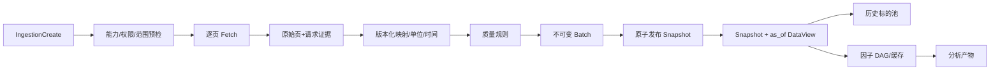

# M1 数据、快照与因子实施

版本：0.1，2026-09-13。状态：M1-05..06 快照发布、PIT DataView 与 UniverseVersion resolver 已落地并按 synthetic 数据验证（Snapshot 幂等发布与 canonical manifest、effective 生效窗口、replay_time 二级上界、static/historical_rule 定义与 canonical hash、快照绑定校验、经 DataView 的历史成员解析与 CacheKey、AC-03/04 反例单测）；M1-01..04 真实 Provider 链路受 DEC-01/02 阻塞，M1-07 起未开始。

前置：`GATE-M0-DONE` 与 `GATE-M1-START`。目标是在已确认的一个市场、资产类别、主频率和真实数据源上，完成可追溯的数据建设与基础因子分析。未批准 DEC-01/02/03 时，只能继续 synthetic、import 和市场无关规则，不能声称完成 M1。

## 1. 端到端数据流



每个步骤的输入配置、实现版本、数量、问题、checksum、开始/结束时间和 Job ID 进入 manifest。上游游标仅存在于 fetch checkpoint，不暴露为数据查询 cursor。

## 2. D1 Provider 接入与拉取

### 2.1 接入验收表

真实 Provider 合入前为每项能力保存脱敏证据：

| 项目 | 最小证据 |
| --- | --- |
| 身份与权限 | 成功/无权限/过期凭据；日志和响应不含 secret |
| 能力 | 数据集、字段、频率、覆盖、PIT level、max page size 与账号实测一致 |
| 分页 | 首/中/末页、空页、实际返回数、游标循环防护、取消 |
| 限流 | 429/供应商错误映射、Retry-After、全局与连接级并发限制 |
| 时间 | 交易时区、事件/公告/采集时间精度、日期边界与夏令时（如适用） |
| 数值 | 原始单位、空值、零、负值、精度、供应商特殊码 |
| 修订 | source record/revision/supersedes 证据；缺历史版本时标记 `pit_unverified` |
| 许可 | 缓存、展示、导出、团队共享和保留期允许范围 |

Provider 私有字段停留在适配器与 raw evidence；Normalizer 输出平台 schema。应用层只依赖注册的 `DatasetSchema`。

### 2.2 更新模式

- incremental：从已成功覆盖水位到目标 `to`，但仍检查日历缺口和重叠修订窗口。
- backfill：按用户明确范围抓取，不从“最新时间”推断开始。
- force：忽略“缓存最新”短路，逐页请求上游并创建新 request/batch 证据；相同 payload 可以 checksum 去重存储。

对重试，每一页以 `connection version + dataset + normalized request + provider cursor/page identity` 去重保存，checkpoint 只在原始页持久化成功后推进。无法证明游标稳定的 Provider 重试整个分片，依靠自然键/修订幂等，不能跳过可能缺失的页。

分片维度（标的、日期、字段）由能力与限流决定，必须记录计划与实际；取消仅在原始页和批次一致的安全点停止。

## 3. D2 标准化、版本与质量

### 3.1 标准化管线

固定步骤：解码 → 原始类型校验 → 证券/主体历史映射 → 时区与时间精度映射 → 单位换算 → 平台字段校验 → provenance 填充 → 稳定自然键/记录哈希。

Normalizer 版本绑定：provider/version、dataset schema、field mapping、unit policy、availability policy、instrument mapping policy。任一语义改变产生新版本，旧 Batch 不后台重写；重新标准化生成新 Batch 并保留来源 raw page。

`available_at` 不能用 `ingested_at` 代替。只有日期没有时刻时，按已批准的保守 policy 计算并记录原始精度；无证据时标记 `pit_unverified`。严格模式拒绝，探索模式在所有派生产物持续携带限制。

### 3.2 质量规则与发布策略

规则分三类：

- row：类型、必要字段、OHLC、负量、非法枚举、单位、数值范围。
- set：重复自然键、时间排序、交易日历缺口、覆盖、修订链、证券映射冲突。
- cross-dataset：价格/复权/公司行为一致性、币种、历史成分、财务科目口径。

每个 Issue 保存 rule version、severity、dataset、字段/记录定位、范围、计数和有限样例。完整错误行通过受控 artifact 下载，不把超大列表塞入 Job event。

质量结果为 `pass | pass_with_warnings | fail`。允许发布条件由版本化 policy 决定；error 不得通过填零、删除问题记录或降低级别自动变为 pass。发布前页面明确显示 batch、policy 和未解决问题。

## 4. D3 快照、文件清单与 PIT 查询

### 4.1 快照发布

发布事务依次验证：

1. 所有 Batch 存在、终态成功、工作区一致且文件 checksum 可读。
2. schema/mapping/availability policy 兼容；相同自然键的修订顺序可确定。
3. 严格 PIT 时不存在被依赖的 `pit_unverified` 数据；质量 policy 允许发布。
4. 构造 canonical manifest，包含有序 batch/file/schema/policy/checksum，计算 manifest hash。
5. 写 Snapshot、引用和审计记录并提交；提交后禁止修改清单。

相同请求可返回已有 Snapshot 或新建等价 Snapshot，由产品决策确定，但两种行为都必须幂等且 manifest hash 相同。不得留下 API 可见的半发布记录。

### 4.2 DataView 选择算法

对查询范围先锁定 Snapshot manifest，仅扫描其列出的文件/批次。候选记录满足：

```text
record.available_at <= as_of
record.event_time in [from, to)
record belongs to snapshot manifest
state record additionally satisfies effective_from <= decision_time < effective_to
```

随后按 dataset 的自然键分组，根据可用时间、修订关系和稳定 tie-break 选择当时可见版本。真实运行回放若提供 `replay_time`，再加 `ingested_at <= replay_time`。选择规则单测需覆盖未来修订、同时间冲突、缺失 supersedes、日期精度和 effective 边界。

查询 cursor 绑定 workspace、snapshot manifest hash、as_of、规范化 filter、sort 和最后稳定键并签名/校验。任一条件变化或 cursor 过期返回 400，不继续错误分页。

## 5. D4 历史标的池

`UniverseVersion` 支持 static 与 historical_rule：

- static 保存显式 instrument_id 列表、创建时点和“静态研究口径”标识。
- historical_rule 引用 membership/trading_status/instrument 等数据集及规则版本，在每个 decision time 解析。

解析必须使用相同 Snapshot/DataView，不从当前数据库表读取最新成分。退市证券保留历史 ID 和代码映射。缓存键包含 snapshot hash、universe version、as_of/range 与 resolver version。

验收 fixture 至少包含：中途加入/移除指数、代码变更、暂停上市/退市、当前列表不含但历史应入样本、effective_to 边界。AC-04 以这些反例证明没有生存者偏差回填。

## 6. D5 因子注册、DAG 与缓存

### 6.1 注册与预检

构建期 Go Factor 与受限 Expression 在统一 registry 中以 `id + version` 暴露。注册阶段验证：

- 参数 schema 可解析，默认值（若有）满足 schema。
- 输入字段、频率、lookback、staleness、PIT、资产类别和输出单位完整。
- 依赖引用精确存在；DAG 无环；同 ID/version 不重复。
- 表达式 AST 只含白名单节点、字段和算子，不支持文件、网络、反射或任意代码。

Run 预检一次返回全部问题：数据集/字段缺失、历史不足、PIT 不足、频率不支持、标的池为空、参数错误、循环或单位不兼容。提交时重新预检，不能只信页面结果。

### 6.2 计算与缓存

拓扑排序后按 decision time/partition 计算；同一横截面标准化只使用该时点历史标的池中可见数据。未来收益 label 进入独立 analysis input，Factor/Strategy DataView 不提供读取接口。

缓存键至少包含设计文档规定的输入快照哈希、UniverseVersion、FactorVersion、规范化参数、运行时/算子版本、区间、频率和 availability policy。缓存条目先写暂存，完整 partition 校验后发布；取消/失败不留下命中项。

缺失值保留 reason，例如 `missing_input`、`insufficient_history`、`stale_input`、`invalid_denominator`、`pit_unverified`、`not_applicable`。统计层分别报告覆盖，禁止用 0 代替。

首批因子由 DEC-01/02 决定。若只有价格研究包，可交付动量、反转、趋势、波动、量价；不能为了展示 PE 页面用今天的 PE 回填历史。

## 7. D6 因子分析

分析配置固定标签价格、入场时点、持有期、分红/成本、分组规则、最小样本和相关方法。输出至少包含：

- 分布、分位数、覆盖率和缺失原因随时间变化。
- 横截面相关性；选股因子的 IC、Rank IC、分组收益与衰减。
- 训练/验证/测试区间标签和样本数；任何拟合只在训练段完成。
- 完整序列 artifact 与页面摘要；降采样只影响图表。

零分母、样本不足或不适用返回 null + reason。IC/分组收益页面注明这是因子证据，不等价于可交易回测。

## 8. 工作包交付顺序

| ID | 交付 | 依赖 | 主要验收 |
| --- | --- | --- | --- |
| M1-01 | 真实 Provider 能力探针与 ADR | DEC-01/02 | 脱敏样本、权限/限流/分页/许可表 |
| M1-02 | instrument/calendar/bar 标准 schema 与 Normalizer | M1-01 | 单位、时区、自然键、坏样本 |
| M1-03 | 拉取 planner/checkpoint/force | M0 Job | AC-01、取消与重试 |
| M1-04 | 质量引擎、Batch 与 raw/normalized manifest | M1-02/03 | AC-02、规则版本 |
| M1-05 | Snapshot 发布与 PIT DataView | M1-04 | AC-03、恢复/checksum |
| M1-06 | UniverseVersion 与 resolver | M1-05 | AC-04 |
| M1-07 | Factor registry/DAG/preflight/cache | M1-05/06 | AC-05、循环/历史/PIT |
| M1-08 | 因子分析与 artifact | M1-07 | 覆盖/null reason/标签隔离 |
| M1-09 | 数据、标的池、因子页面闭环 | API 完成 | 仅界面跑通成功/失败/重试 |

## 9. 向选股与历史复盘提供的边界

M1 不在 DataView 内实现筛选语法，也不让选股绕过 FactorEngine：

- DataView 为 ScreenRun/ReplaySession 提供固定 `snapshot + as_of` 的字段与历史查询；调用方不能覆盖可见上界。
- UniverseResolver 返回当时母池，选股条件只在其成员上执行；Replay 持仓即使退出母池仍通过显式持仓查询保留。
- FactorEngine 先按因子声明的完整横截面和窗口计算，再由选股执行硬条件；优化不得先缩小母体而改变因子值。
- Dataset/Factor 能力目录需提供类型、单位、频率、staleness、历史覆盖和支持操作，供选股 preflight 与表单使用。
- DataView/Factor 缓存需把 Replay 的 session/revision/as_of 纳入调用方缓存键，禁止跨历史日期泄漏未来值。

选股的具体工作包见 [M1S 选股实施](m1-screening.md)。Replay 的会话时点查询见 [M2R 手动历史复盘实施](m2-manual-replay.md)。这些消费者不改变 M1 的 PIT、修订、单位和严格模式规则。

## 10. M1 完成证据

- 真实 Provider 样本证据与限制矩阵，不包含凭据。
- schema、mapping、availability 与 quality policy 的版本和变更说明。
- AC-01..05 自动化结果；PIT 反例和历史成分 fixture 可复跑。
- 数据规模、查询、因子缓存、磁盘占用与恢复基准；阈值来自 DEC-03，不临时自定。
- 从连接到因子分析的浏览器录像/报告和 artifact checksum。
