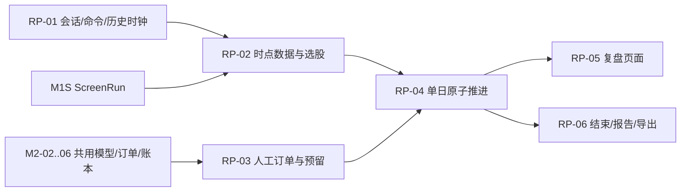

# M2R 历史选股与手动模拟交易实施

版本：0.2，2026-09-14。状态：RP-00 契约、RP-01 纯状态机，以及 RP-02 的**时点隔离纯规则**已落地；RP-02 的服务层/持久化/端点未开始（见 §5）。设计来源为 [历史选股与手动模拟交易设计](../historical-replay-trading-design.md)。REPLAY-01..10 / RP-AC-01..14 已进入主需求与 OpenAPI；RP-01 提供无 DB/网络/时钟的会话状态机与命令并发原语，不表示订单、页面、撮合或账本已经实现。

## 1. 定位与系统边界

用户在冻结历史数据上逐个交易日推进，查看截至当前历史时点的资料和选股结果，人工提交订单，再由后续事件驱动模拟成交、账户和报告。

该流程：

- 不是自动 Backtest：不要求 StrategyVersion 或 ValidationSplit，不能提交假策略复用 BacktestCreate。
- 不是长 Job：ReplaySession 跨越多次用户操作；准备、单日推进、结束和导出才使用短 Job。
- 不是实时模拟盘或实盘：没有实时数据、券商凭据或外部下单权限，不解锁 M4。
- 不新建第二套撮合/账本：复用 M2 的 MarketRules、FillSimulator、CostModel、Ledger 和 MetricPolicy。
- 不允许回退并覆盖历史：回看只读；重新练习创建新会话并关联来源。

首期“单市场、股票、单币种、仅做多现金账户、空仓开始”仍是待批准范围建议，不是默认规则。真实仿真必须通过 [决策与门禁](decisions-and-gates.md) 中的 Replay 门禁。

## 2. 依赖与切片安排



RP-01 的纯状态/并发模型可在 M0 Job/DataView 上用 synthetic fixture 先行。RP-02 依赖 M1 PIT/Universe 和 M1S。RP-03/04 的真实语义依赖 DEC-01/02/06、Replay 专项模型决策以及账本 oracle；无需等待 M2 自动策略/实验页面全部完成，但共用核心只能实现一次。

## 3. 契约接入与兼容门禁

### RP-00 正式化设计

在开发前完成：

1. 将 REPLAY-01..10、RP-AC-01..14 纳入主需求与追踪。
2. 批准 ReplayConfig 的市场/账户/时钟/结束政策；未批准项保持 Blocked。
3. 在 `docs/api/build_openapi.py` 增加 replay-sessions、data/query、screens、orders、advance、account、events、notes、close、report 和 exports 契约。
4. 同步 OpenAPI JSON、Go DTO/映射、TS 类型、数据库枚举与 operation-walking 契约测试。
5. 若 `Job.result_refs` 新增 replay_session/replay_step，验证旧消费者对未知 enum 的行为；首期不静默扩展 Experiment.kind。

ReplayDataQuery 是会话范围的只读 POST；服务端覆盖 snapshot/as_of 上界，浏览器不能提交未来时点。写命令除统一 Idempotency-Key 外必须携带 expected_revision。金额、价格、数量仍是 Decimal 字符串。

## 4. RP-01 会话、命令与历史时钟

### 4.1 领域对象

建议 `internal/replay` 包含：

| 对象 | 关键契约 |
| --- | --- |
| ReplayConfig | snapshot/universe、区间、日历/时区/日终 policy、预热、初始现金、market/fill/cost/reservation/valuation/metric、strict PIT、基准 |
| ReplaySession | config hash、current_as_of、revision、state、account/checkpoint ref、source_session、seen range、end reason |
| ReplayCommand | command/session、expected_revision、kind、输入、现实 submitted_at、服务端 historical decision_at、幂等摘要 |
| ReplayStep | from/to、start/end revision、job/fencing、事件范围、checkpoint hash、summary |
| ManualOrder | session/command、instrument、side/type/TIF、qty/limit、effective_at、reservation、cum fill、status/reason |
| ReplayEvent | session + monotonic sequence、historical_at、recorded_at、type、command/order/fill/ledger refs |
| ReplayCheckpoint | session/revision/as_of、account、open orders、model state、event high-water、checksum |

现实时间只用于审计；所有 historical decision_at 由服务端当前会话决定。ReplaySession ID、模拟账户 ID 与未来真实账户 ID 使用不同类型/命名空间。

### 4.2 状态机与串行化

```text
initializing -> awaiting_action
awaiting_action -> advancing -> awaiting_action
awaiting_action -> closing -> completed
initializing|advancing|closing -> failed
```

Session 不存在 paused/running 长租约。用户等待时停在 `awaiting_action`；离开页面无需暂停。每个改变订单、账户或时间的命令按 session_id 串行化：

- 相同幂等命令返回原结果。
- 不同命令使用同一 revision 竞争，仅一个成功，其余 409 `session_conflict`。
- advancing/closing 期间不接受下单、撤单或第二次推进。
- 命令记录与 revision 条件更新处于同一事务，不能先显示成功后落库失败。

会话事件是永久业务日志，JobEvent 只是有窗口的执行状态。二者 sequence、保留和 API 不混用。

## 5. RP-02 历史数据与选股隔离

### 5.1 服务端可见性

所有历史查询由 ReplayService 从 Session 派生 `snapshot_id + current_as_of + session_revision`，并限制：

- `available_at <= current_as_of`，历史 effective 区间有效。
- K 线已结束且按 policy 可用；财报只按已版本化发布时间/可用时间。
- 查询范围不超过当前时点；未来 labels、价格、成员、状态和导出均不返回。
- 缓存键含 session、snapshot hash、as_of、revision、字段与计算版本。

模拟器在推进隔离区可读取下一日事件，但提交 checkpoint 前不得将其暴露给查询、选股、订单预览或报告。前端不得预取整个区间再隐藏未来数据。

### 5.2 会话内选股

`POST /replay-sessions/{id}/screens` 只接受 screener_ref 与 expected_revision；snapshot、universe、as_of/timezone、strict mode 由会话覆盖。ScreenRun 保存 source session/revision。会话推进后旧结果只读显示为历史名单，不替换当前选择。

提交订单时验证 screen_run（若提供）属于同工作区/会话，snapshot/as_of/revision 不在未来；无论来源如何，都重新检查当前市场状态、资金与库存。用户也可对母池内未入选标的下单并记录 source=`manual`。

已交付（`internal/replay/scope.go`，无 DB/网络/时钟）：

- **`ReadScope` 由会话派生**：`ScopeOf(session, config, snapshotHash)` 一次性校验三者——会话必须携带**自己的**那份冻结 config（`ConfigHash` 比对，否则会把会话和别人的 universe 配在一起读）、snapshot 绑定与 manifest hash 必须存在、会话必须有决策时点；任一缺失即 fail-closed。`From` 是会话配置的历史起点，`AsOf`/`Revision` 取会话的**已提交**时点与修订，所以 advancing 期间的读仍停在 C(D)，不会看到"新价格 + 旧账户"的半状态——读因此不需要状态门。
- **读范围不超过决策时点，且是拒绝而不是截断**：`Resolve(query)` 返回生效的半开 `[from, to)`。不带 range 的读等价于"会话历史到决策时点"（起点等于决策时点、没有历史可推导时明确报 `replay.range_invalid` 并提示显式给范围，而不是给一张没有原因的空图）；显式 range 只要 `to > as_of` 一律 `replay.future_read`——静默裁剪会让调用方以为拿到了完整窗口，这正是"先预取整段再隐藏未来"要防的行为；`to == as_of` 合法（右开）。查询缺 dataset/frequency/成员/字段、成员或字段为空、range 反向、会话不匹配分别有明确错误码（`replay.query_invalid`/`replay.session_mismatch`/`domain` 的区间码）。
- **缓存键覆盖"能看到什么"**：`CacheKey(query, computationVersion)` 先解析再取键，键含 session、snapshot hash、as_of、revision、**生效区间**、dataset/frequency、排序去重后的成员与字段、以及计算版本；等于同一集合的不同列出顺序共享键，换 revision/时点/窗口/计算版本必然换键。空计算版本被拒（否则昨天的推导会被当成今天的版本回读）。
- **会话内选股只由会话决定输入**：`ScreenRunInputsOf(session, config, command, screenerRef)` 产出 `ScreenInputs`，其 snapshot/universe/as_of/timezone/strict 全部来自会话与冻结 config，调用方只能给 screener 版本引用与 command；并且要求 `expected_revision` 匹配、命令 kind 为新增的 `CmdScreen`、状态为 `awaiting_action`（advance 期间不得选股）。结构上就没有可提交的未来时点。
- 测试：`internal/replay/scope_test.go`（config 配对/缺 snapshot hash/无决策时点、派生区间、边界恰在决策时点合法而 1ns 之后拒绝、整段在未来拒绝、七类畸形查询、无历史时的显式范围、缓存键的集合语义与 revision/时点/版本分离、选股输入全部来自会话且拒绝错 kind/错 revision/非 awaiting_action/无版本引用）。

未交付：会话与命令的持久化（`replay_sessions`/`replay_commands`/`replay_steps` 等，见 §8.1）、`ReplayService` 服务层与 `POST/GET /replay-sessions*` 端点、K 线/财务读接口的 DataView 装配，以及浏览器页面。这些都被 **model registry（M2-02）** 挡住：`ReplayConfig` 要求 `market_rules`/`fill_model`/`cost_model`/`valuation_policy`/`metrics_policy` 的 `ModelBinding`，契约明确无隐式默认值，而模型注册表受 DEC-01/02、DEC-05/06、REPLAY-DEC-01..03 门禁、尚未存在。上面这些纯规则不依赖任何模型，因此可以先落地。

## 6. RP-03 人工订单、资金与库存预留

### 6.1 订单边界

首期仅启用 MarketRules + FillModel 都声明支持的 market/limit 与 TIF。订单提交只创建 accepted/rejected 事实，不创建 Fill。改单通过撤余量 + 新订单，保留 replacement link。

订单状态至少为 accepted、partially_filled、filled、cancelled、expired、rejected。取消只影响未成交余量；`cum_qty <= order_qty` 永远成立。相同 fill ID 同内容幂等，不同内容为运行冲突。

### 6.2 Reservation policy

必须版本化定义：

- 买单价格/费用估算、buffer、市场单跳空后的 insufficient cash 行为。
- 卖单可卖数量与结算限制；多卖单不能重复预留。
- 多订单排序 `effective_at, submit_sequence, order_id`。
- 卖出资金何时可供买入、最低费用如何跨部分成交结算。
- 同证券同 Bar 的共享成交量额度。

下单事务原子保存 order、资金/数量 reservation、command、ReplayEvent 与 session revision。页面估算不是成交承诺；推进时按真实模型复核。未知规则不得用零费用、昨收或无限流动性补齐。

## 7. RP-04 单日原子推进与恢复

### 7.1 日段算法

以当前 checkpoint C(D) 为唯一输入，推进到日历确定的下一个决策时点：

1. Job 领取 ReplayStep 租约，验证 expected revision、session state 与 fencing token。
2. 创建隔离的 pending state，读取 `(D decision, D+1 decision]` 事件。
3. 按版本化总顺序处理订单生效/过期、公司行为、市场资格、共享流动性、成交、费用、Ledger、结算和估值。
4. 生成订单/Fill/journal/估值/事件与 C(D+1)；校验资金、数量、引用与 checksum。
5. 文件先按内容寻址发布；元数据事务再次检查 revision、fencing 和取消状态，原子发布全部引用并更新 session as_of/revision/state。
6. 事务后通知 Job Hub；通知失败不影响已提交事实。

页面在步骤 5 前只能看到 C(D)。不得暴露“新价格 + 旧账户”的半状态。

### 7.2 故障与取消

- 提交前崩溃：丢弃/隔离未引用文件，从 C(D) 确定性重算。
- 提交后崩溃：C(D+1) 已成为事实，恢复不得重复 Fill 或倒回。
- 旧 Worker：fencing token 不匹配，不能提交。
- 取消先获胜：未发布推进废弃，恢复 C(D) awaiting_action。
- 提交先获胜：取消返回冲突/已完成，不撤销成交。
- 不可恢复故障：保留已提交历史，Session 标 failed 并给出恢复/新会话路径，不删除整个会话。

故障注入至少覆盖：事件读取中、artifact rename 后、元数据事务前/后、Job 终态前、续租丢失、取消竞争和双标签推进。

## 8. RP-05 持久化、API 与页面

### 8.1 元数据

迁移编号实施时分配。最小表：

| 表 | 关键约束 |
| --- | --- |
| replay_sessions | workspace/id、config/hash、state、current_as_of、revision、checkpoint、source/seen range |
| replay_commands | session + command/idempotency 唯一、expected/applied revision、payload hash、result |
| replay_steps | session + from_revision 唯一、job/fencing、from/to、checkpoint/result refs |
| manual_orders | session/order 唯一、command、terms、reservation、cum qty、status/version |
| replay_events | session + sequence 唯一、historical/recorded time、typed refs、payload/version |
| replay_checkpoints | session + revision 唯一、as_of、account/open-orders/model-state refs、checksum |
| replay_notes | append-only note、session revision/as_of、author、created_at；修订另加记录 |

Fill、ledger entry 与大报告按共用核心/Artifact 存储，但必须能从 session/event 追溯。所有列表游标绑定 workspace、session、已提交 revision/结果、filters 与稳定键。

### 8.2 页面

新增 `/replay-sessions`、`/replay-sessions/new`、`/replay-sessions/:id`。主界面始终显著显示历史时点/时区、snapshot、revision 与质量限制；现实时间只在日志。

账户、K 线、订单和持仓来自同一已提交 revision。持仓即使退出母池仍可见且可按模型减仓。下单成功文案是“委托已受理”，不是“已成交”。推进期间锁定变更操作，刷新后恢复同一 Job；409 要求刷新事实，不自动重放不同命令。

未来数据隔离需要网络级浏览器测试：检查响应与缓存中不存在 D+1 数据，而非只看屏幕没有显示。

## 9. RP-06 结束、报告与导出

达到末端或用户提前结束：

1. 拒绝新订单；按冻结 end policy 取消余量并释放 reservation。
2. 保留真实持仓、最后合法估值与估值缺失状态，不按最后已知价强制平仓。
3. 发布最终 checkpoint/report，Session 进入 completed。
4. 最后决策点禁止提交依赖未来数据的新订单；需要延长时创建新会话/明确来源，不修改原范围。

报告包含账户与交易结果、订单/拒绝/过期/部分成交、费用/滑点、持仓、基准、人工笔记与选股来源、所有 model/policy/hash、近似假设、source session/seen range。人工练习不能标记为自动策略样本外验证。

导出按工作区授权和数据许可，订单/Fill/Ledger/Report scope 显式；checksum 与最终 checkpoint 绑定。运行中报告标 `is_final=false`，结束后冻结。

## 10. 工作包与交付证据

| ID | 可独立交付 | 主要证据 |
| --- | --- | --- |
| RP-00 | 主需求/OpenAPI/错误/DTO/生成链 | operation 契约、enum 兼容、权限/幂等/revision |
| RP-01 | Config/Session/Command/历史时钟 | `internal/replay`：状态机（initializing→awaiting_action→advancing→awaiting_action、closing→completed、failed）；Command{command_id, expected_revision} 乐观并发与 409 `replay.revision_conflict`（双标签竞争）；服务端 DecisionClock 决定 decision_at，命令不携带历史时间 |
| RP-02 | 会话 DataView、K 线/字段与选股 | D+1 服务端拒绝、缓存隔离、ScreenRun 来源 |
| RP-03 | 人工订单、reservation、共用模型接口 | 多订单资金/库存/流动性 oracle |
| RP-04 | 单日推进、checkpoint、恢复 | 提交前后崩溃、旧 token、取消竞争、重放一致 |
| RP-05 | 列表/创建/主界面完整闭环 | 刷新/断线/空名单/无交易/键盘/窄屏 |
| RP-06 | 结束、报告和导出 | 余单取消、持仓保留、null 估值、许可/checksum |

## 11. 验收门禁

RP-AC-01..14 的测试映射见 [验证与追踪](verification-and-traceability.md)。`GATE-REPLAY-DONE` 还要求：

- REPLAY-01..10 已进入主需求，OpenAPI/Go/TS/迁移/handler 同步。
- 相同冻结输入与同一人工命令日志重放，ScreenRun、Order、Fill、Ledger、Checkpoint 和报告业务内容一致。
- 当前 revision 的所有页面数据同源，未来内容未出现在响应、缓存或导出。
- 会话跨服务重启恢复，不重复推进；JobEvent 丢失不影响完整 ReplayEvent 历史。
- 真市场/账户 policy 未批准或未通过 oracle 时，只能声明 synthetic 会话骨架完成。
- 完成 Replay 不改变 M4 的 Blocked 状态，不产生任何外部订单能力。

