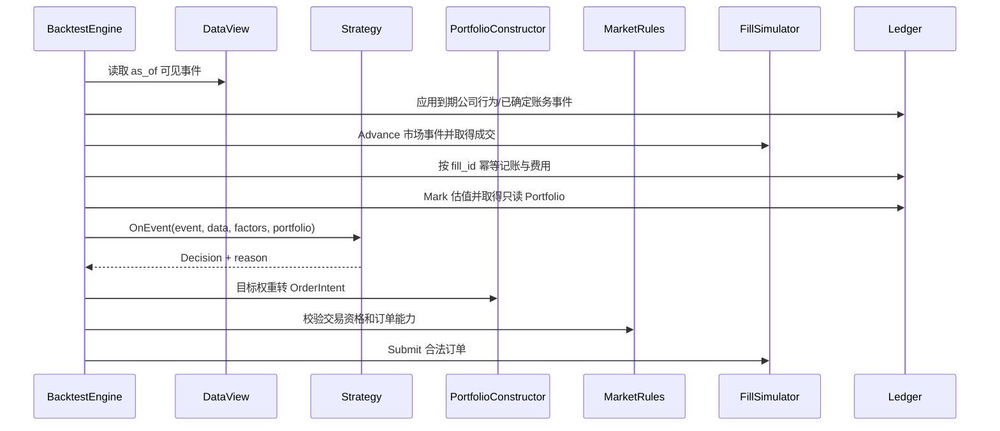

# M2 策略、回测与研究闭环实施

前置：`GATE-M1-DONE`、DEC-05 和 DEC-06。目标是在已版本化的数据、标的池、策略与市场模型上，生成逐层可解释、账务可核对、重跑可复现的研究结果。

## 1. 回测运行契约

每个 Backtest Run 冻结：Snapshot、UniverseVersion、StrategyVersion、MarketRules、CostModel、FillModel、MetricPolicy、区间、频率、决策时区、初始资金/币种、基准、价格政策、随机 seed、严格 PIT 和 ValidationSplit。任何引用缺失或版本不匹配都在预检失败，不回退到 latest。

历史手动复盘不是 Backtest Run：它没有 StrategyVersion 或 ValidationSplit，由 ReplaySession 与人工命令提供决策输入。两条流程只共享市场规则、订单、成交、费用、账本、估值和指标实现，不能复用不匹配的 HTTP DTO 或生命周期。

Run 创建后输入不可变；重跑创建新 Run/Job 并记录 `source_run_id`。Job 负责执行生命周期，Run 负责研究身份与证据；Job 重试不得生成多个可见终态结果。

## 2. 固定事件顺序

市场模型必须给出同一时间戳的总顺序。首个真实模型由 DEC-01/06 明确，下列是框架顺序约束，不是某市场的默认成交规则：

具体市场可规定公司行为、开盘/收盘、撮合和估值的不同子顺序，但版本化后必须固定且进入 manifest。收盘信号若只能在下一个可交易时点成交，预检/模拟器不得用当前收盘价无条件成交。同 Bar 同时触及止盈止损等不可判定路径按 FillModel 的明确保守/确定策略处理并写入订单原因。

所有事件排序键至少为 `event_time, model_priority, instrument_id, source_sequence, stable_id`。并行计算不得改变决策、订单、成交或账本顺序。

## 3. R1 策略版本与运行时

### 3.1 StrategyVersion

保存 template/version、参数 schema、规范化参数、精确 FactorVersion、标的池使用方式、筛选/排序/权重/调仓/退出/风险限制、研究假设与失败标准。编辑永远创建新版本。

受限表达式解析为版本化白名单 AST。保存前验证类型、单位、参数范围和因子依赖；后端以 canonical JSON 哈希，前端展示同一规范化结果。

### 3.2 策略隔离

- 每个 Run 由 Factory 创建新 Strategy，不共享可变状态。
- StrategyContext 是只读快照，只提供 DataView、Portfolio copy 与已计算 FactorPoint。
- 逻辑时钟、seeded RNG 和遥测由显式能力注入；不读系统时钟、网络、文件或数据库。
- Decision 保存 ID、触发事件、目标权重和人可读/机器可检索 reason。
- Initialize/OnEvent/Finish 均接受 context；超时或取消后不得继续发出决策。

策略契约测试对同一事件流运行两次，比较 Decision 内容和顺序；并发运行验证实例状态不串扰。

## 4. R2 预检与组合构建

预检一次返回全部 Issue，至少覆盖：

- Snapshot/Universe/Strategy/Factor/Model 精确版本、工作区和区间兼容。
- 数据覆盖、lookback 预热、PIT、历史标的池、基准、价格和公司行为数据。
- 市场规则支持频率、订单类型、交易单位、价格限制、卖出可用性和资产类别。
- 初始资金币种、最小下单、费用/滑点/流动性参数、估值与 metric policy。
- ValidationSplit 顺序、不重叠、覆盖绩效区间；预热不进入绩效。
- 目标权重有限、单位一致、总和/现金策略明确；无法成交后的余量处理明确。

PortfolioConstructor 将目标权重转换为 OrderIntent 时使用真实未复权交易价格、lot/tick/currency 与可用现金；确定性的舍入与余量策略属于版本化实现。MarketRules 只校验，不写账本。阻塞 Issue 存在时 POST `/backtests` 返回 422，不创建可运行 Job。

## 5. R3 撮合、费用与唯一账本

### 5.1 FillSimulator

维护 pending order 状态，以订单 ID 幂等接收 Submit/Cancel，并按事件推进产生 Fill。模型版本明确：成交时点、可用价格、部分成交、流动性上限、滑点、涨跌/价格限制、停牌、TIF、撤单和同 Bar 歧义。

不支持的订单类型明确拒绝；不把“无法模拟”转换为立即全额成交。随机模型只使用 Run seed 与稳定子流，分区/并行调整后结果仍可复现。

### 5.2 CostModel

费用以 Fill 和当时 DataView 为输入，输出带币种 Money 明细。最低费用、阶梯、卖方税费等规则按市场模型版本定义；未知规则不是零。费用与滑点分别记录，报告不得合并掩盖。

### 5.3 Ledger

Ledger 是现金、持仓、可卖数量、成本、实现/未实现损益和权益的唯一写入者：

- `ApplyFill` 以 fill_id 幂等，同 ID 不同内容为冲突并使 Run 失败。
- `ApplyCorporateAction` 以事件/修订 ID 幂等，区分除权、登记、支付与持仓生效时点。
- 现金分红与复权价格不能重复计收益；成交和账本只用真实可交易价格。
- 每笔 journal entry 借贷/数量守恒，引用触发事件、order、fill 和 policy version。
- `Mark` 只按已批准价格政策估值；缺价/陈旧值返回 Issue，不偷偷沿用或归零。

手算 oracle 对每个事件列出期初现金/持仓、订单、成交、费用、公司行为、期末现金/持仓/市值/权益，逐行与 ledger entries 对平。浮点只用于统计，账本使用 decimal。

### 5.4 共用模拟核心的两种驱动

共用核心输入为冻结模型、合法 OrderIntent、顺序市场事件和独立 Ledger，不感知浏览器或 Strategy。自动回测由 Strategy → PortfolioConstructor 产生订单；手动复盘由已授权且带 session revision 的 ManualOrderCommand 产生订单。两者都必须经过相同 MarketRules、reservation/资金边界、FillSimulator、CostModel 与 Ledger。

人工订单需要冻结资金/库存、订单状态和跨日 pending state；这些能力若先由 Replay 切片实现，应放入共用领域包并补自动回测兼容测试，不能留在 `internal/replay` 私有 handler 中形成第二套成交语义。Replay 的完整实施见 [M2R 文档](m2-manual-replay.md)。

## 6. R4 结果发布与确定性

运行先写私有暂存输出。成功路径：

1. 完成策略与模拟器 Finish，关闭所有 partition writer。
2. 校验订单→成交→账本引用、现金/数量守恒、序列排序与 artifact checksum。
3. 使用固定 MetricPolicy 生成报告；缺失指标保留 reason。
4. 构造 canonical manifest，记录 build hash、所有版本、配置、seed、环境兼容信息和 artifact 清单。
5. 在受 fencing token 保护的事务中原子发布 RunResult 与 Job succeeded；取消先获胜时删除/隔离暂存结果。

确定性验收在相同输入下比较：Decision、OrderIntent、Fill、ledger entry 和 manifest 中的业务内容逐项一致；创建时间、Job ID 等非业务字段应从 canonical 比较中排除并明确列表。统计值使用 MetricPolicy 定义的算法和容差，不能只比较 UI 四舍五入值。

## 7. R5 报告与指标口径

MetricPolicy 版本化定义收益采样、年化频率、无风险利率、基准价格/全收益、币种转换、回撤、换手、胜率配对、缺失/短样本和数值容差。

报告至少包含需求定义的收益、波动、最大回撤及持续期、Sharpe、Sortino、Calmar、换手、费用占比、集中度、基准差异、持仓暴露和逐笔记录。每项 Metric 保存 name、value/null、unit、definition 与 missing_reason。

报告清楚分开训练、验证、测试和预热；记录测试集首次/每次使用历史。不能通过重命名 Run 或 StrategyVersion 把已查看的测试段重新标为未看过。图表降采样 artifact 与完整精度 series 分开，统计只读完整序列。

## 8. R6 实验、对比、重跑与导出

Experiment manifest 是研究索引，不复制或覆盖原 Run 证据。列表支持版本、日期、标签、状态和区间筛选；用户研究备注单独可变并保留审计。

对比先检查币种、区间、基准、MetricPolicy、样本划分和价格口径。兼容项才计算差异；不兼容项分栏展示原因，不放入统一排名。异步对比产物保存输入 Run ID 和算法版本。

重跑使用原规范化配置创建新 Run/Job，记录来源；如果引用资源已归档仍可读取，如果物理内容丢失则 fail closed。变更参数不是重试，而是新 StrategyVersion/Run。

研究包 manifest 至少包含接口文档列出的版本、hash、参数、snapshot、时区、数据依赖、输出、风险、metric policy 和 checksums。导出前执行许可 policy；受限原始数据只输出引用/摘要。下载按 artifact_id 授权解析，不接收本地路径。

## 9. 工作包与验收

| ID | 交付 | 依赖 | 主要验收 |
| --- | --- | --- | --- |
| M2-01 | StrategyVersion/Template/表达式 | 因子 registry | 参数/单位/版本/实例隔离 |
| M2-02 | 市场、费用、成交、metric policy registry | DEC-01/06 | 能力声明与未知模型拒绝 |
| M2-03 | Backtest preflight/Run 创建 | M2-01/02 | 全问题返回、提交时重检 |
| M2-04 | PortfolioConstructor/订单因果链 | M2-03 | lot/tick/cash/余量确定性 |
| M2-05 | FillSimulator/CostModel | M2-02/04 | AC-06、部分成交/撤单/流动性 |
| M2-06 | Ledger/公司行为/估值 | M2-05 | AC-07、幂等/冲突/逐项对平 |
| M2-07 | Engine/确定性发布 | M2-03..06 + Job | AC-08、取消竞争、重跑一致 |
| M2-08 | Analyzer/Report/series/records | M2-07 | 指标定义、null reason、完整精度 |
| M2-09 | Experiment/Compare/Export | M2-08 | 兼容检查、checksum、许可 |
| M2-10 | 策略/回测/实验页面闭环 | 所有 API | AC-09/10、失败与恢复 |

M2R 可在 M2-02、M2-05、M2-06 的共用模型与账本稳定后并行推进 RP-03/04，不必等待自动策略页面和实验对比全部完成；但 `GATE-M2-DONE` 与 `GATE-REPLAY-DONE` 分别验收，互不冒充。

## 10. M2 测试矩阵

| 场景 | 断言 |
| --- | --- |
| 收盘信号与成交 | 非法同收盘成交被拒绝或按明确模型延后，AC-06 |
| 同 Bar 多路径 | 固定排序/保守规则稳定，reason 可见 |
| 部分成交与取消 | pending 状态、费用和剩余数量一致 |
| 重复/冲突 Fill | 相同内容幂等，不同内容失败，不双记账 |
| 公司行为 | 现金、股数、成本和估值按时点对平，不重复收益 |
| 缺价/停牌/币种 | 明确 Issue，不沿用未知值或归零 |
| 重跑/并行 | 事件、订单、成交、账本相同，统计满足容差 |
| Worker 崩溃/取消 | 最多一个可见 RunResult，旧 token 不发布 |
| 对比 | 不同 metric/币种/区间不直接排名 |
| 导出 | manifest/checksum/权限/许可可验证 |

M2 只有在浏览器完整执行“策略→预检→回测→报告→对比→导出”、手算 oracle 与故障测试都通过后完成。单个高收益示例不是软件验收证据。
