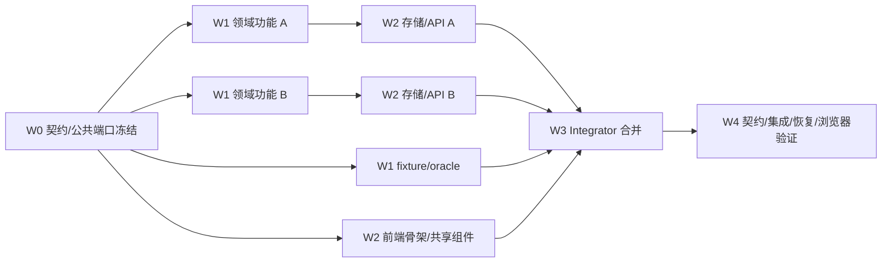

# 多 Agent 并发编码与集成交付规范

版本：0.1，2026-09-12。状态：Active。本文规定如何将实施工作包分配给多个 Agent，同时保护现有改动、契约一致性、迁移顺序和最终验证。它不改变任何业务需求、接口或完成门禁。

## 1. 适用原则

并发单位是“有明确输入、输出和所有权的工作包”，不是阶段、目录或临时口头任务。多个 Agent 可以同时实现互不重叠的领域、适配器、前端和测试切片，但以下条件必须同时成立：

- 前置门禁和依赖已满足；Blocked 决策没有被示例默认值绕过。
- 每个文件或共享契约在同一时间只有一个写入所有者。
- 工作包从明确的 integration base commit 开始，使用独立分支和独立 worktree。
- 接口、迁移、生成物和依赖变更由指定所有者串行完成。
- 单包测试通过不等于阶段完成；必须由 Integrator 合并后运行集成验证。

默认不允许多个 Agent 直接在同一个脏工作区写文件。若宿主环境无法提供独立 worktree，则退化为严格的目录/文件租约：同一时刻仅一个 Agent 写工作区，其他 Agent 只能只读分析或在独立临时目录准备补丁。

## 2. 角色与职责

| 角色 | 主要职责 | 不得做的事 |
| --- | --- | --- |
| Integrator | 冻结基线、拆工作包、维护所有权、安排合并顺序、解决跨包冲突、运行最终验证、更新状态与 MEMORY | 在未理解 Agent 变更时机械合并；用局部测试替代集成验证 |
| Contract Owner | 主需求、OpenAPI 生成源/生成物、Go/TS DTO、错误码、公共端口、契约测试 | 与其他 Agent 同时改契约热点；手改生成物 |
| Migration Owner | 预留迁移编号、schema/索引/兼容与回滚恢复测试 | 多 Agent 各自猜迁移编号；改写已应用迁移 |
| Backend Agent | 在冻结契约上实现领域、应用、存储或 handler 纵向切片 | 私自扩大公共接口；顺手修改无关包 |
| Frontend Agent | 在冻结 OpenAPI/生成类型上实现页面、共享组件和浏览器测试 | 本地发明 DTO/错误语义；修改生成 API schema |
| Verification Agent | 构造 fixture/oracle、故障注入、契约/浏览器/容量验证并审查证据 | 为通过而弱化测试；把 Not Run 写成 Passed |

一个 Agent 可以承担多个角色，但同一共享热点仍只能有一个当前 Owner。小规模协作推荐一名 Integrator、一个契约/迁移通道、一个或两个功能通道；并发宽度以共享热点和验证能力为限，不追求 Agent 数量最大化。

## 3. 分支、worktree 与工作包登记

### 3.1 分支规则

- Integrator 指定基线，例如 `m0-foundation@<commit>`；工作包不得从“当前脏目录”自行推断基线。
- 每个工作包使用独立分支，建议 `agent/<work-package>-<slug>`，例如 `agent/m0-06-data-http`。
- 每个分支使用独立 Git worktree；不得共享 `node_modules` 以外的可写源码目录。缓存可以共享只读下载内容，但测试输出和数据库必须隔离。
- Agent 不直接合并其他分支，不强推 integration branch，不改写他人提交历史。
- 基线变化时，由 Integrator 决定 rebase、merge 或重新生成补丁；Agent 不在有未提交改动时自动同步。

### 3.2 Work Order

每个并发工作包开始前登记以下内容。可记录在协作任务系统；需要仓库内留痕时放入 `docs/verification/work-orders/`，完成后与验证证据一起归档。

```markdown
# Work Order <ID>

- Owner:
- Status: Ready | In Progress | Review | Integrated | Verified | Blocked
- Integration base commit:
- Objective and acceptance IDs:
- Allowed paths:
- Shared files requiring owner handoff:
- Explicit no-touch paths:
- Inputs/contracts and versions:
- Expected outputs:
- Required local checks:
- Integration checks:
- Blocked decisions/assumptions:
- Handoff commit and evidence:
```

`Allowed paths` 是授权上限，不表示必须修改全部文件。Agent 发现需要超出范围时先停止写入并请求 Integrator 扩展 Work Order。

## 4. 文件所有权分级

### 4.1 串行共享热点

以下路径默认由单一 Owner 修改，不能分给多个并发 Agent：

| 热点 | Owner | 原因 |
| --- | --- | --- |
| `docs/requirements.md`、`docs/interfaces.md` | Contract Owner | 需求与领域/HTTP 语义源 |
| `docs/api/build_openapi.py`、`docs/api/openapi.json` | Contract Owner | 生成源与生成物必须原子同步 |
| `web/src/api/schema.d.ts`、API runtime 公共类型 | Contract Owner | 前端生成契约与运行时兼容 |
| `internal/server/contract_test.go`、公共错误映射 | Contract Owner | operation/错误行为统一 |
| `internal/domain` 公共 ID、Decimal、Issue、错误码 | Contract Owner 或指定 Domain Owner | 改动影响全部模块 |
| `internal/ports` 跨模块公共端口 | Contract Owner | 防止接口漂移和循环依赖 |
| `internal/store/migrations/` | Migration Owner | 编号、顺序、校验和及兼容不可冲突 |
| `go.mod`、`go.sum`、`web/package.json`、lockfile | Dependency Owner（通常 Integrator） | 依赖与许可证需要统一决策 |
| `cmd/researchd/main.go`、全局路由注册 | Integrator 或 Wiring Owner | 多切片最终接线热点 |
| `scripts/verify.ps1`、`README.md`、`MEMORY.md` | Integrator | 验证入口与项目状态只能在整合后更新 |

共享热点变更采用“提案 → Owner 修改 → 生成/验证 → 通知下游同步”的顺序。功能 Agent 可以提交接口需求和测试样例，但不直接在自己分支建立不受控的公共契约变体。

### 4.2 可并发的功能私有区

在接口冻结后，以下类型通常可以独立所有：

- 单个 `internal/<feature>` 包及其内部测试。
- 单个 Provider/Normalizer 适配器及脱敏 fixture。
- 单个前端 feature 路由、组件和测试，前提是不修改生成 API 或全局主题/路由热点。
- 独立数值 oracle、PIT fixture、故障注入用例和文档证据。
- 选股纯规则与 Replay 纯状态机，但共享 Fill/Ledger 仍需单一 Owner。

若两个工作包都需要同一文件，应拆出前置公共工作包，由一个 Owner 先合入；不能约定“各改一半，最后手工拼”。

## 5. 并发波次与依赖图



| 波次 | 允许并发 | 退出条件 |
| --- | --- | --- |
| W0 契约冻结 | 调研、fixture 设计可并发；契约写入串行 | 主需求、DTO、错误、端口、迁移计划和 acceptance IDs 确认 |
| W1 领域与 oracle | 不同 feature 私有包、纯规则、状态机、测试数据 | 各包单元/属性测试通过，无公共接口私改 |
| W2 适配与 UI | 独立存储/handler、前端 feature、故障测试 | 契约测试与 feature 集成测试通过，生成物无漂移 |
| W3 集成 | Integrator 串行合并，Agent 只协助解释/修复自己范围 | 合并树无冲突、迁移连续、路由/依赖统一 |
| W4 验证 | 测试套件可分机器并行，结果由 Integrator 汇总 | 统一验证、恢复/oracle/浏览器门禁完成，Not Run/Blocked 明确 |

## 6. 当前路线的并发矩阵

### 6.1 M0 当前阶段

| Lane | 工作包 | 可并发对象 | 共享热点/合并条件 |
| --- | --- | --- | --- |
| Contract | M0-06 数据 HTTP 契约与 result refs | M0-07 前端非业务共享组件 | 独占 OpenAPI、生成 TS、contract_test、公共错误 |
| Backend | M0-06 handler、ingestion/snapshot Job handler 接线 | Frontend、恢复 fixture | 等 Contract 合入；`cmd/researchd/main.go` 由 Wiring Owner 最后接线 |
| Frontend | M0-07 Layout、theme、JobStatus/PagedTable 基础 | Backend | 不发明数据 DTO；业务页面等生成契约 |
| Verification | M0-05/06 崩溃、PIT、force、质量 fixture | Backend/Frontend | 不改生产实现；失败回传对应 Owner |
| Integration | M0-08 synthetic 纵向切片 | 无代码并发写 | 等 M0-06/07 合入后串行完成和验证 |

当前工作区已有未提交的 M0-05/06 代码时，必须先由现有 Owner 完成或提交到明确分支，再创建新 worktree；不能让新 Agent 从这个脏工作区并发写同一路径。

### 6.2 M1 与 M1S

| Lane | 工作包 | 可并发对象 | 不可并发热点 |
| --- | --- | --- | --- |
| Data | M1-01..05 Provider/Normalizer/Quality/Snapshot | S1-03/04 纯选股规则、fixture | DataView/schema 公共语义 |
| Universe/Factor | M1-06/07 | Provider 适配、选股规则 | Factor/Universe 端口由 Contract Owner 冻结 |
| Screening Rules | S1-03 三值逻辑、S1-04 排名评分 | M1 Data、前端框架 | 不修改 OpenAPI/FactorEngine |
| Screening Contract/Store | S1-01/02、S2-02 | 纯规则测试 | OpenAPI、迁移、result_refs 分别串行 |
| Screening UI | S3 | S2 后端完成后的其他独立 feature | 全局路由和生成 API 由 Owner 合并 |
| S4 Integration | 静态池、回测时点校验 | 无共享代码并发 | Universe/Backtest 边界由 Integrator 审查 |

### 6.3 M2 与 M2R

| Lane | 工作包 | 可并发对象 | 不可并发热点 |
| --- | --- | --- | --- |
| Strategy | M2-01/03 策略版本与预检 | RP-01 Replay 状态机、报告 oracle | 公共 VersionRef/Issue 不私改 |
| Simulation Core | M2-02/04/05/06 市场、订单、Fill、Cost、Ledger | Strategy、Replay Session/API 外壳 | MarketRules/Fill/Ledger 单一 Owner；禁止复制到 replay |
| Replay State | RP-01/02 Session、revision、历史 DataView/Screen | Strategy、Simulation Core | Job/result_refs、DataView 公共端口由 Owner 冻结 |
| Replay Orders | RP-03/04 reservation 与逐日推进 | 报告/UI | 必须等待 Simulation Core；订单/账本原子边界同一 Owner 审查 |
| Reporting | M2-08/09 与 RP-06 policy/oracle | Strategy/Replay 状态 | MetricPolicy 与 Artifact schema 单一 Owner |
| UI | M2-10 自动回测、RP-05 Replay 可分 feature | 后端 lane | 全局导航、ResearchContextBar、API 生成物串行 |

## 7. Agent 本地完成与交接

每个 Agent 交接必须提供：

1. Work Order ID、基线 commit、最终 commit 和实际修改文件。
2. 行为摘要、契约假设和未决问题；区分事实、推断、Blocked。
3. 运行的精确命令、结果、平台与 Not Run。
4. 数据库迁移、生成物、依赖、配置或安全影响；没有也要明确写“无”。
5. 需要 Integrator 执行的合并顺序和冲突风险。
6. 对应需求/验收 ID 与证据路径。

Agent 的分支状态最多标为 `Review`，不能自行把阶段或跨包 Gate 标为 Verified。只有 Integrator 在集成基线上完成规定验证后更新 `Integrated/Verified`、正式验证记录和项目 MEMORY。

## 8. 合并顺序与冲突处理

默认顺序：契约/公共端口 → migration → 领域 → 存储 → handler/wiring → 生成客户端 → 前端 → fixture/文档状态。具体顺序由 Work Order 依赖覆盖。

- Integrator 每次只合并一个逻辑提交，立即运行受影响范围检查；失败先定位到引入提交。
- 生成冲突通过重新运行生成器解决，不手工拼接 JSON/TS 生成物。
- migration 冲突通过重新编号尚未合入的迁移并重跑空库/升级测试；已发布迁移不改写。
- 公共接口冲突回到 Contract Owner 统一设计，功能 Agent 不增加兼容 shim 掩盖分歧。
- 业务语义冲突或门禁不足时标记 Blocked 并停止扩张，不让“先合再说”成为隐式决策。
- Integrator 不使用强制回滚、批量格式化或清理来处理冲突；保留用户和其他 Agent 的现有改动。

## 9. 验证责任矩阵

| 验证 | 功能 Agent | Verification Agent | Integrator |
| --- | --- | --- | --- |
| 单元/属性测试 | 编写并运行 | 审查反例与缺口 | 合并后重跑 |
| 契约/生成同步 | 提出需求、消费冻结类型 | 增加契约反例 | Contract Owner 修改，Integrator 最终检查 |
| 存储/迁移 | 运行私有适配器测试 | 崩溃/升级/恢复用例 | 连续迁移和集成恢复 |
| 浏览器 | feature 组件测试 | 成功/失败/键盘/网络隔离 | 集成环境 E2E |
| 数值/PIT/账本 | 实现对 oracle | 独立构造与审查 oracle | 阶段门禁复跑 |
| race/容量/故障 | 报告能运行的范围 | 执行专项矩阵 | 汇总 Passed/Blocked/Not Run |

任何 Agent 都不得删除、跳过或弱化有效测试来使分支变绿。环境原因导致无法执行时，交接记录原因、风险和 Integrator 所需环境。

## 10. 并发完成定义

多 Agent 工作只有在以下条件全部满足时才算完成：

- 每个 Work Order 的范围、基线、Owner、提交和证据可追溯。
- 无两个未结束 Work Order 同时拥有同一共享热点。
- 所有公共契约、迁移、生成物和依赖由指定 Owner 统一合入。
- Integrator 在合并基线上完成受影响检查和阶段规定的统一验证。
- 冲突解决没有覆盖用户或其他 Agent 的未合并工作。
- 文档状态区分 Agent 分支通过、已集成与阶段 Verified；没有夸大完成度。
- 最终 README、实施状态、验证记录和 MEMORY 由 Integrator 一次性同步，避免各分支重复追加或互相覆盖。

