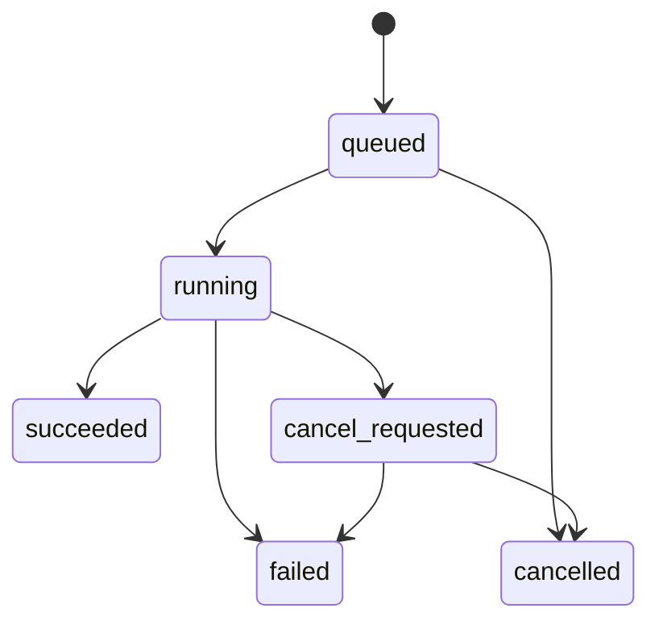

# Go 模块与 HTTP 接口契约 v0.1

状态：Proposed。Go 内部扩展点见 [contracts.go](contracts/contracts.go)，HTTP 字段与端点见 [OpenAPI](api/openapi.json)。两者分别代表领域接口和传输 DTO，通过应用层映射；不要求 Go 领域对象直接序列化为 HTTP。

## 1. 契约原则

- Go `context.Context` 必须贯穿 I/O 与计算取消；SDK 不自行启动无限后台循环。
- 数据源不依赖研究服务，策略不依赖数据库或供应商 SDK。
- 能力声明中明确数据集、字段、频率、历史覆盖、时间证据和分页上限；能力不支持返回明确错误，禁止悄悄降级频率或换源。
- 因子、策略、模型通过 `id + version` 精确解析。注册失败、找不到版本或参数非法时不能退回最新版本。
- 参数使用 JSON Schema 描述，但核心配置保持强类型；`json.RawMessage` 仅用于经 schema 校验的扩展参数、表达式和产物清单。
- 插件指逻辑扩展，首期采用 Go 构建期注册。避免以 Go 动态共享库作为跨 Windows/Linux 的默认接入方式。
- 未来远程因子/模型可以增加 RPC 适配层，传递快照与可用时点约束；不能绕过 DataView 获取未来值。

## 2. 内部扩展接口与职责

| 接口 | 主要方法 | 输入/输出与职责 |
| --- | --- | --- |
| ProviderFactory / DataProvider | ConfigSchema、Open、Describe、Check、Fetch | 创建绑定连接版本的适配器；分页返回原始批次，不负责写入研究结果 |
| Normalizer | Schema、Normalize | 统一字段、单位、代码和时间，输出 Observation 与问题清单 |
| DataStore / DataView | Append、PublishSnapshot、OpenView、Query | 追加修订、原子发布快照；只读视图绑定快照及决策时间 |
| UniverseResolver | Resolve | 在指定历史时点解析标的，不能使用今天的成分替代 |
| Factor / FactorRegistry | Spec、Validate、Compute、Resolve | 注册元信息及计算依赖，执行受约束的因子计算 |
| FactorEngine | Preflight、Run | 预检与编排完整因子计算任务，分析标签通道与策略输入隔离 |
| StrategyFactory / Strategy | New、Initialize、OnEvent、Finish | 每个运行创建独立实例，输出目标权重与决策原因 |
| PortfolioConstructor | Orders | 目标权重转换为订单意图，显式处理现金、交易单位及余量 |
| MarketRules | Validate | 校验交易资格、订单规则、持仓可用性；不执行账本写入 |
| CostModel / FillSimulator | Fees、Submit、Cancel、Advance | 独立定义费用与成交时序、滑点、流动性；模拟器维护待成交单 |
| Ledger | ApplyFill、ApplyCorporateAction、Mark | 唯一账户写入边界，按成交/公司行为 ID 幂等记账与估值 |
| BacktestEngine | Preflight、Run | 编排时钟、数据、策略、撮合、账本；不修改输入版本 |
| JobService | Submit、Get、Cancel、Retry、Events | 调度和任务状态，不代替领域计算 |
| ExperimentStore / ArtifactStore | SaveResult、GetResult、Put、Get | 原子保存结果引用及有校验和的产物 |
| ResearchExporter | Export | 导出版本化研究包，不直接对交易账户下单 |
| ResearchAnalyzer | Evaluate、Compare | 统一指标口径、缺失原因和跨实验对比，输出报告与版本化产物 |

第一版策略输出目标权重，原生订单级策略是扩展项，需增加单独声明的 SDK 能力而不能混用目标权重与直接订单。图中模型组合的调用顺序为：决策 → 组合构建 → 市场规则校验 → 模拟成交 → 费用计算 → 唯一账本写入 → 估值。

## 3. 数据与因子语义

### 3.1 快照和查询

`DataView` 是不可变的 `snapshot_id + as_of` 查询能力。数据查询区间统一左闭右开；`available_at > as_of` 的记录不可见。需要报告期或状态生效区间的查询由 dataset schema 定义，不用一个时间字段代替全部含义。

同自然键下修订不能覆盖原值。版本选择顺序与 [数据目录](factor-data-catalog.md) 一致。Provider 的分页游标属于上游；对外 API 的游标属于固定快照，两者不直接互传。

发布快照需显式列出批次，冻结 schema、映射、质量报告、时间政策和文件校验和。失败不留下可查询的半发布快照。强制抓取可产生相同内容，但必须记录确实发起请求及新批次；内容相同可以存储去重。

### 3.2 因子规范

每个版本必须具备：资产适用范围、输入字段、频率、lookback、数据最大陈旧度、缺失政策、公式/实现版本、参数 schema、输出单位、依赖因子版本。

缓存键至少包括：输入快照哈希、UniverseVersion、FactorVersion、参数规范化哈希、运行时/算子版本、计算区间、决策时间政策。缺失依赖、窗口不足、循环依赖都在执行前报告。

横截面标准化只在同一决策时点可见的标的池上计算；模型训练的填充、标准化和降维只在训练段拟合。未来收益标签存放在分析通道，策略 DataView 不能访问。

## 4. HTTP 通用规范

前缀 `/api/v1`。采用 OpenAPI 3.1、JSON、UTF-8，字段 snake_case。成功响应直接返回指定资源，无统一 `data` 包裹；分页返回 `{items, next_cursor}`。时间采用带时区 RFC3339 字符串，交易日期采用 YYYY-MM-DD。版本号是不透明字符串，ID 不携带市场默认值。

HTTP 资源 `id` 唯一标识一个不可变版本记录；`version` 是该记录的版本标签，`VersionRef` 中两者必须匹配。逻辑上的同一个因子/策略通过 parent_id 串联版本；GET by id 不自动跳到最新版本。后台创建资源时分配 ID，创建计算任务时预分配 run_id，便于 202 后跳转运行详情。

- 价格/数量/金额采用十进制字符串，统计数值为 JSON number，缺失用 null 加原因。
- 资源列表：`limit` 默认 50、最大 200；`cursor` 不透明；`q`、`sort` 仅作用于声明字段，稳定排序追加 ID。
- 筛选、排序变化后游标作废；无效或过期游标返回 400，客户端从首页重查。
- 数据行接口另限每页 1000，超量查询必须分页或异步导出；拒绝无边界的大范围返回。
- 未知字段默认拒绝；资源参数与扩展参数由各自 schema 校验。未来新增字段需遵循版本兼容性约定。
- 创建配置/版本同步返回 201；耗时操作返回 202 Job 并带 `Location: /api/v1/jobs/{job_id}`；客户端必须看 Job 终态，不把 202 当成功完成。
- 请求追踪使用 `X-Request-ID`，服务端校验长度与字符或重新生成；错误包含 request_id。

### 4.1 幂等、并发与认证

所有 POST 写操作要求 `Idempotency-Key`，按调用者/工作区/方法/路径限定作用域。相同键与相同规范化请求返回原响应；同键不同请求返回 409。首期 HTTP 重试窗口不少于 24 小时，过期键返回 409 `idempotency_key_expired` 而不是悄悄再次执行；必要的轻量键摘要保留至工作区删除。业务 Job 和 Run ID 另外永久去重至相关资源合法清理。

本稿不提供更新不可变版本的 PATCH。编辑通过创建下一版本；需要维护草稿时另加 ETag/If-Match，并先定义冲突解决，不套用最后写入覆盖。

OpenAPI 默认 Bearer 身份认证。个人本地无认证模式作为显式部署选项，只允许回环绑定；不能作为共享部署配置。所有资源读取、事件订阅和下载都须执行相同工作区授权。浏览器 SSE 通过支持请求头的 fetch 流读取，不在 URL 中传 token。

### 4.2 标准错误

```json
{
  "code": "missing_dataset",
  "message": "计算该因子需要历史估值数据",
  "request_id": "req_example",
  "retryable": false,
  "issues": [{"code": "missing_field", "path": "inputs.valuation.pe_ttm", "message": "快照中没有 pe_ttm", "severity": "error"}]
}
```

| HTTP 状态 | 场景 |
| --- | --- |
| 400 | 请求结构、时间区间、游标非法 |
| 401 / 403 | 未认证 / 无资源权限 |
| 404 | 资源或明确指定的版本不存在 |
| 409 | 幂等冲突、状态冲突或结果尚未就绪 |
| 422 | 数据依赖、因子参数、模型能力、PIT 或市场配置预检失败 |
| 429 | 本地限流或上游配额暂不可用，可附 Retry-After |
| 500 / 503 | 内部故障 / 服务临时不可用；不返回供应商凭据或堆栈 |

典型业务码：`unsupported_capability`、`missing_dataset`、`insufficient_history`、`pit_unverified`、`invalid_parameter`、`unknown_version`、`market_rules_required`、`result_not_ready`、`idempotency_conflict`、`cancel_not_allowed`。

## 5. API 功能分组

准确的请求字段、必填项、响应 schema 以 [OpenAPI](api/openapi.json) 为准。下面给出用户操作到服务边界的映射。

| 分组 | 端点 | 作用 |
| --- | --- | --- |
| 适配器 | GET `/providers`、GET `/providers/{id}` | 能力、配置 schema 与版本 |
| 凭据 | POST `/secrets` | 一次写入密钥，只返回 secret_ref |
| 数据源连接 | GET/POST `/connections`、GET `/connections/{id}`、POST `/connections/{id}/check` | 配置版本和异步连接测试；更改配置创建新连接版本 |
| 导入 | POST `/imports` | 上传 CSV/Parquet 到受限暂存区并校验；返回任务与导入产物引用 |
| 数据更新 | POST `/ingestions` | 供应商拉取或绑定已上传 import_id；增量、补数、force 模式 |
| 数据目录 | GET `/datasets`、GET `/datasets/{id}` | schema、单位、时间政策、覆盖与质量 |
| 数据批次 | GET `/batches`、GET `/batches/{id}` | 查更新任务产出的原始与标准化批次、质量问题 |
| 快照 | GET/POST `/snapshots`、GET `/snapshots/{id}` | 发布/读取不可变快照 |
| 数据预览 | POST `/data/query` | 在指定快照、时点、字段、区间内分页查询 |
| 标的池 | GET/POST `/universes`、GET `/universes/{id}` | 静态/历史规则版本 |
| 历史成员 | POST `/universes/{id}/resolve` | 按快照和决策时点分页预览历史成员 |
| 因子 | GET `/factors`、GET `/factors/{id}`、POST `/factors` | 注册表达式版本；Go 因子由部署注册，列表统一展示 |
| 因子计算与分析 | POST `/factor-runs`、GET `/factor-runs/{id}` | 批量计算与按指定标签窗口分析，结果由 artifact 获取 |
| 因子预检与分析结果 | POST `/factor-runs/preflight`、GET `/factor-runs/{id}/analysis` | 返回全部依赖问题或指定因子的分析与序列引用 |
| 策略模板 | GET `/strategy-templates` | 后端注册的模板、参数 schema 与所需能力 |
| 策略版本 | GET/POST `/strategies`、GET `/strategies/{id}` | 可视化配置产生不可变版本 |
| 模型 | GET `/models` | 已注册市场、费用、成交、时间可用性及指标口径模型与参数 schema |
| 回测 | POST `/backtests/preflight`、POST `/backtests`、GET `/backtests/{id}` | 全量预检、启动、查询输入与状态 |
| 回测结果 | GET `/backtests/{id}/report`、GET `/backtests/{id}/records` | 报告及分页订单/成交/持仓/现金记录 |
| 净值序列 | GET `/backtests/{id}/series` | 分页获取完整精度净值、回撤、基准与样本分段 |
| 实验 | GET `/experiments`、GET `/experiments/{id}`、POST `/experiments/compare` | 浏览所有试验、读取 manifest、异步同口径对比 |
| 任务 | GET `/jobs`、GET `/jobs/{id}`、POST `/jobs/{id}/cancel`、POST `/jobs/{id}/retry`、GET `/jobs/{id}/events` | 进度、取消、重试和 SSE |
| 导出 | POST `/exports`、GET `/artifacts/{id}`、GET `/artifacts/{id}/content` | 异步生成报告/数据/研究包、下载 |

暂不开放实盘下单 API。后续交易接入单独版本化，其账户与订单生命周期不复用研究 Job。

因子预检和回测预检成功完成检查时返回 200 `{valid, issues}`；`valid=false` 表示不能启动。真正提交运行时后端重新预检，存在阻塞问题返回 422，避免仅依赖页面校验。历史成员解析、数据查询和预检均为只读 POST，不要求幂等键。

分析 JSON 产物使用 OpenAPI 中 `ResearchSeries` 格式，对比结果使用 `ComparisonResult`；不能把前端需要理解的结构藏在未定义任意 JSON 中。大矩阵使用带字段 schema 和单位的 Parquet/CSV，文件元信息来自 Artifact。净值接口只允许时间顺序对应的稳定分页，`sort=id/-id` 不适用于该接口。

## 6. 任务状态与恢复



结果发布与取消受理使用同一原子终态保护。成功先提交则取消返回 409；取消先受理则 Worker 不再发布成功结果，完成清理后进入 cancelled。重复取消已取消任务返回当前状态。

任务失败/取消后重试创建新 Job，保存 parent_job_id。带副作用的数据拉取允许重复请求，但规范数据自然键与修订、结果发布必须幂等。默认重新执行，只有实现了可验证检查点的任务才续跑；不声称 exactly-once 执行。

Worker 通过租约与 fencing token 领取任务；重启回收超时租约，旧 Worker 不能提交终态产物。任务配置冻结，重试按原配置；改变参数创建新研究运行。

SSE 每条事件含 `id`（单任务单调序号）、`event: job.updated`、`data: JobEvent`。支持 `Last-Event-ID` 重放。事件窗口过期返回 410，客户端 GET Job 后重新订阅；不能静默丢事件。心跳不增加业务序号；断线采用有上限退避；可降级到轮询 Job。事件仅报告状态，不携带大矩阵。

## 7. 成果包与未来接入

研究包 manifest 至少包含：schema_version、run_id、策略/因子/模型版本、构建哈希、参数、输入快照哈希、交易时区、数据依赖、输出约定、风险限制、统计口径、产物清单与校验和。

模拟或实盘消费者先进行兼容性检查，不能将研究包导入动作等同于启用交易。账户、券商连接、实时风险状态和密钥不进入研究包。授权不允许的数据只导出引用及摘要，不打包原始内容。

## 8. 契约验证与演进

- 本稿 Go 文件仅验证接口自洽及编译，业务正确性需在实现时通过数据、PIT、账本和任务测试。
- `python docs/api/build_openapi.py` 重新生成 OpenAPI；修改生成源后同步提交 JSON，不独立编辑生成产物。
- `python docs/api/check_contract.py` 检查本地引用、端点参数、操作 ID、生成同步和文档链接；这是结构检查，不代替完整 OpenAPI 规范验证或运行测试。
- OpenAPI 结构与引用须检查；开发时据其生成 TypeScript 客户端并做服务端契约测试。
- 破坏性 HTTP 改动新增主版本；因子公式/时间政策/单位变化必须新增资源版本，不能仅修改描述。
- 扩展接入验收：能力声明 → 配置 schema → 原始样本 → 单位/时间映射 → 分页与错误 → 断点/限流 → 快照与回放 → 文档化限制。
