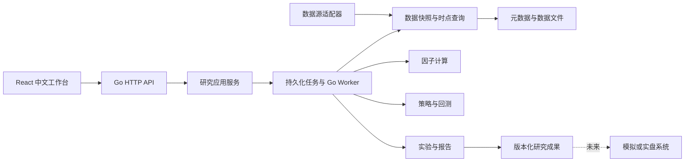

# 策略研究平台需求说明 v0.1

日期：2026-09-12。状态：Proposed。本文是需求基线，不代表实现或验证完成。

## 1. 产品目标与已确认边界

面向策略研究者，提供从数据接入、因子开发、策略配置、回测、稳健性验证到研究成果归档的完整流程。用户能够在浏览器界面完成日常研究；开发者能够通过稳定接口接入数据、因子和策略实现。

已确认：后端业务使用 Go；提前定义内部扩展接口与前端 API；支持后续界面操作；明确因子库的数据需求。

本稿选择：React + TypeScript + Vite、Ant Design、Apache ECharts 构建中文工作台；采用 HTTP JSON API 和 SSE 任务事件；Go 模块化单体加后台任务执行器。依赖具体版本在开发启动时锁定。

本稿建议：首期交付研究闭环和成果导出，实盘只预留扩展边界。首期市场与频率未确认，股票类数据是因用户提到 PE 而展开的需求分支，不视为已选择 A 股。

## 2. 成功标准

用户能够在界面完成：配置数据源 → 更新并检查数据 → 创建不可变数据快照 → 选择历史标的池 → 配置因子与策略 → 预检 → 运行回测 → 查看风险与收益来源 → 对比实验 → 导出研究成果。

系统对研究过程负责，不以某个收益率或夏普阈值作为软件交付标准。缺少必要数据或市场模型时必须给出可定位的原因，不能输出看似完整的结果。

## 3. 首期范围

### 3.1 必须交付

- 单个已确认市场和主要频率的完整研究流程；其他市场通过接口扩展。
- 数据源能力发现、连接配置与凭据引用、字段映射、更新任务、质量报告、快照管理。
- 基础算子、参数化因子、因子依赖检查、计算任务、覆盖率与统计分析。
- 参数化策略模板：标的池、筛选、排序、权重、调仓、退出和风险限制。
- 事件驱动回测、成交与账户流水、费用和滑点模型、市场规则适配。
- 收益与风险报告、样本内外标识、基准比较、实验重跑和对比。
- Web 页面操作、持久化异步任务、取消与失败恢复、结果导出。

### 3.2 后续扩展

多因子组合优化、滚动参数搜索、机器学习训练、分布式计算、团队权限、模拟交易、实盘对接。

不把任意 Go 代码在线编辑执行、在线安装第三方二进制、Tick 排队撮合、多市场完整规则同时纳入首期。界面首期支持已注册因子与策略模板的配置，以及受限表达式组合；新的 Go 实现由开发者构建、测试并注册。

## 4. 功能需求

| ID | 模块 | 需求与边界 | 优先级 |
| --- | --- | --- | --- |
| DATA-01 | 数据源 | 注册适配器，返回数据集、字段、频率、时间覆盖、分页和限额能力；不支持的能力明确报错 | P0 |
| DATA-02 | 接入配置 | 配置连接、凭据引用、字段映射和单位转换；连接测试不泄露凭据 | P0 |
| DATA-03 | 数据更新 | 支持增量、补数和强制重新抓取；强制模式即使缓存最新也请求上游；并发、重试和供应商限流可配置 | P0 |
| DATA-04 | 数据质量 | 检查缺失、重复、OHLC 关系、负成交量、单位、交易日历、覆盖范围及时间可用性 | P0 |
| DATA-05 | 版本快照 | 原始批次、标准化版本、修订记录和质量报告可追溯；发布快照不可变 | P0 |
| DATA-06 | 历史标的池 | 保存上市、退市、历史成分和生效区间；静态自选池标明静态研究口径 | P0 |
| FACTOR-01 | 因子定义 | 定义名称、版本、公式/实现、字段依赖、参数、频率、回看窗口、单位、缺失策略和适用资产 | P0 |
| FACTOR-02 | 因子计算 | 校验依赖图并拒绝循环依赖；按快照、版本、参数、标的池和时点规则计算与缓存 | P0 |
| FACTOR-03 | 因子分析 | 分布、覆盖率、相关性；选股因子增加 IC、Rank IC、分组收益和衰减分析；标签仅用于评价 | P0 |
| FACTOR-04 | 组合表达式 | 支持白名单算子、参数校验、标准化、排序、加权；禁止文件、网络、任意代码执行 | P0 |
| STRAT-01 | 策略版本 | 从模板创建不可变版本，固定因子版本与参数，保存研究假设和失败标准 | P0 |
| STRAT-02 | 组合约束 | 目标权重、持仓数量、单标的上限、换手和调仓计划；支持范围由市场模型声明 | P0 |
| BT-01 | 运行预检 | 校验数据、预热区间、市场规则、成本、资金、基准和样本划分；返回全部问题 | P0 |
| BT-02 | 回测执行 | 固定逻辑时钟与事件顺序；信号、目标持仓、订单、成交、账本逐层追踪 | P0 |
| BT-03 | 交易仿真 | 费用、滑点、部分成交、撤单、流动性约束；不支持的订单类型禁止运行 | P0 |
| BT-04 | 权益核算 | 使用真实交易价格及公司行为核算现金、持仓、费用、分红；避免复权和现金分红重复计收益 | P0 |
| REPORT-01 | 报告 | 净值、回撤、收益分布、基准、持仓暴露、换手、成本和逐笔记录；指标口径随报告保存 | P0 |
| EXP-01 | 实验归档 | 保存代码/构建哈希、策略/因子版本、快照、配置、环境、种子、日志和产物校验和 | P0 |
| EXP-02 | 对比重跑 | 可筛选、标注、对比、重跑；重跑创建新任务，保留来源运行 ID | P0 |
| VALID-01 | 样本外验证 | 时间顺序划分开发/验证/测试；记录试验次数和测试集使用历史，不能重新标成未看过 | P0 |
| VALID-02 | 稳健性 | 批量参数扰动、成本压力、分市场阶段与滚动验证；记录所有试验 | P1 |
| JOB-01 | 后台任务 | 任务落库后执行，支持进度、取消、事件恢复、失败原因、重试关系及重启恢复 | P0 |
| UI-01 | 界面闭环 | 首期功能均可通过页面操作，不要求用户使用命令行或手工拼 JSON | P0 |
| INT-01 | 外部扩展 | 数据源、因子、策略、撮合、存储、成果交付均定义 Go 接口；HTTP 使用 OpenAPI | P0 |

P0 是首期必需，P1 是研究能力扩展。具体因子家族是否能启用取决于数据，而非仅取决于功能优先级。

## 5. 核心业务对象

| 对象 | 内容 | 不可变边界 |
| --- | --- | --- |
| Provider / Connection | 适配器能力与具体连接配置；两者分开 | 连接变更生成配置版本，运行绑定旧版本 |
| Dataset / Snapshot | 字段 schema、原始批次、数据修订、可用时间政策、质量证据 | 快照发布后不可修改 |
| UniverseVersion | 静态列表或有时间效力的标的池规则 | 被实验引用的版本不可修改 |
| FactorVersion | 输入依赖、公式或实现、参数 schema、窗口、输出单位 | 新增版本替代覆盖更新 |
| StrategyVersion | 模板版本、因子版本、筛选排序、仓位和调仓参数 | 新增版本替代覆盖更新 |
| ModelVersion | 市场规则、费用、滑点、成交和估值政策 | 参数和实现均有版本 |
| Job / Run | Job 管执行生命周期；Run 管研究输入、结果与证据 | 终态结果不可原地覆盖 |
| Artifact | 报告、逐笔记录、因子矩阵或策略包 | 内容寻址或保存校验和 |

运行中的数据、策略和成本配置不随外部编辑改变。只有任务进度和独立研究备注可更新。引用中的资源不能物理删除；归档只隐藏常规列表，不破坏复现。

## 6. 时间、数值与正确性

1. 每条观测区分事件时间、公开发布时间、研究可用时间、系统采集时间、修订版本。具体见数据目录。
2. 决策时点只能读到该时点已经可用的数据；历史回测的研究可用时间不能直接用今天下载数据的时间替代。
3. 只有公告日期、缺少日内时间时，必须显式选用并版本化保守可用时间政策；不默认为当天开盘已知。
4. 回测必须指定数据快照、标的池版本、策略版本、模型版本、运行区间、资金币种、初始资金、决策时区、基准及价格口径；未提供必要项返回预检错误。
5. 金额、价格、数量对外用十进制字符串，对内使用定点/十进制数；因子和统计可以使用 float64，但禁止 NaN/Infinity 出现在 JSON，缺失值附原因。
6. 比率统一使用小数，例如 5% 存为 0.05；PE/PB 为倍数；金额和成交额带币种；股、合约、供应商的手或万股在接入层转换。
7. 确定性执行固定排序与随机种子；依赖并行浮点计算的结果规定容差。订单与账本要求逐项一致。

## 7. 技术架构与接入边界

### 7.1 统计与评价口径

报告至少提供区间收益、年化收益、年化波动、最大回撤及持续期、Sharpe、Sortino、Calmar、换手、费用占比、持仓集中度及相对基准收益。指标存在零分母、过短样本或不适用情况时返回 null 与原因。

回测首期不引入外部出入金；若以后支持，必须分别定义时间加权和资金加权收益。年化频率、收益采样、无风险利率输入、基准价格/全收益、回撤计算以及交易胜率的开平仓配对方法全部由版本化 metric policy 明确，不能由前端临时计算。报表固定该 policy 及参数，不同口径的实验不能直接排名。

选股因子分析固定标签入场时点、持有期、价格/分红口径、分组规则与成本假设；IC 为同一横截面因子与后续收益的相关性，Rank IC 为秩相关性。IC 和分组收益是研究证据，不能代替含交易约束的策略回测。训练、验证、测试区间按时间排序且不重叠，并明确覆盖运行区间；预热区间单独记录，不参与绩效统计。

### 7.2 部署与模块

依赖方向：传输层 → 应用服务 → 领域接口；供应商 SDK、数据库和文件格式位于适配层。前端不直接连接数据供应商或数据库，策略不能直接访问网络和系统时钟。

建议首期元数据使用 SQLite，行情/因子矩阵使用分区 Parquet 和不可变文件清单，全部通过仓储接口访问；这是假设个人或少量本地并发的技术起点。若首期确定团队并发或多 Worker，则在实施前选定 PostgreSQL 和任务抢占机制。Parquet 驱动选择与性能需用代表性数据验证，不强行引入第二种业务语言。

首期可将编译后的前端静态文件随 Go 服务分发。服务与计算任务逻辑隔离，长期任务不占用 HTTP 请求生命周期。后续可以将 Worker 拆为独立进程而不改变前端协议。

## 8. 安全与运维需求

- 无认证的本地模式只允许显式启用且绑定回环地址；对外或共享部署必须先完成身份认证、工作区隔离和服务端权限校验。
- 凭据通过后端 secret reference 读取；页面配置只接收一次密钥写入，不回显明文，不进入日志、URL、报告或前端持久存储。
- 网络拉取、CPU、内存、数据扫描量、实验并发设定配置上限；大型批量任务在启动前显示规模估算。
- 记录 request_id、job_id、run_id、失败码；数据库与产物联合备份，恢复后校验引用和校验和。
- 本地磁盘路径不作为外部 API 参数；下载按 artifact_id 授权解析。导入文件通过受限上传入口进入暂存区。

## 9. 实施阶段与验收

| 阶段 | 交付 | 验收证据 |
| --- | --- | --- |
| M0 契约与基础 | Go 项目骨架、OpenAPI、任务状态机、合成数据适配器、最小界面框架 | 接口验证、任务恢复与取消用例、类型生成检查 |
| M1 数据与因子 | 一个真实数据源、质量报告、快照、历史标的池、基础因子、对应操作页面 | 能在页面接入、更新、查看数据并计算因子；单位/PIT/修订测试 |
| M2 研究闭环 | 策略模板、选定市场模型、回测、报告、实验对比、导出 | 从页面完整跑通一项研究；人工样本账务核对与重跑一致 |
| M3 研究增强 | 更多数据与因子、滚动验证、参数批量任务 | 全部尝试可追溯；样本泄漏和成本压力案例 |
| M4 交易接入 | 模拟/实盘适配器及独立运行保障 | 另行明确账户、场所、对账、风控、恢复和准入验收 |

| 验收 ID | 关联需求 | 可验证场景 |
| --- | --- | --- |
| AC-01 | DATA-03 | 缓存已最新时执行强制更新，确认仍请求上游并保留新批次记录 |
| AC-02 | DATA-04/05 | 重复行、错误单位、缺失交易日可定位；不可通过静默填零发布合格快照 |
| AC-03 | DATA-05/BT-02 | 修改未来记录与未来财报修订，不改变过去时点的因子、信号和订单 |
| AC-04 | DATA-06 | 历史退市标的与历史成分按生效时间进入样本，无当前名单回填 |
| AC-05 | FACTOR-01/02 | 缺少 PE 所需历史估值时返回字段依赖错误；价格类因子可独立运行 |
| AC-06 | BT-01/03 | 用收盘信号在该收盘价无条件成交的非法配置被拒绝；同 Bar 止盈止损歧义按固定模型处理 |
| AC-07 | BT-04 | 在小规模手算案例中，现金、持仓、费用、权益及公司行为逐笔对平 |
| AC-08 | EXP-01/02 | 快照和配置固定后重跑，账本一致，统计值满足文档化误差界限 |
| AC-09 | JOB-01 | 重复提交同一幂等键仅创建一次；取消、断线重连、Worker 重启不会重复发布结果 |
| AC-10 | UI-01 | 仅用界面完成更新→快照→因子→策略→预检→回测→对比→导出，并覆盖失败和重试 |
| AC-11 | VALID-01 | 训练预处理不读取验证/测试数据；测试集使用历史保留，不能被重新命名掩盖 |
| AC-12 | INT-01 | 新适配器仅实现契约和字段映射即可接入；应用层不引用供应商私有字段 |

## 10. 待确认决策

| ID | 决策 | 当前状态 | 阻塞范围 |
| --- | --- | --- | --- |
| DEC-01 | 首期市场、资产类别、主要频率 | 待确认 | 真实数据验收、市场模型、因子首发列表 |
| DEC-02 | 数据供应商、历史范围、权限预算、历史修订覆盖 | 待确认 | 真实接入与研究可信度承诺 |
| DEC-03 | 个人本地或团队部署；数据量和并发目标 | 待确认 | 数据库最终选择、认证、性能验收数值 |
| DEC-04 | 仅研究、研究加模拟、是否包含实盘 | 待确认；本稿按研究闭环拆分 | M4，不阻塞 M0 |
| DEC-05 | 与其他交易系统共享哪些模型或成果格式 | 待确认 | 成果包最终映射，不自动依赖其他仓库 |
| DEC-06 | 首个验收策略、资金/币种、费用/滑点、基准口径 | 待确认 | M2 真实市场回测验收 |

这些决策不阻塞接口、任务、合成数据和界面框架设计；不能用示例市场规则或零费用替代缺失决策。
