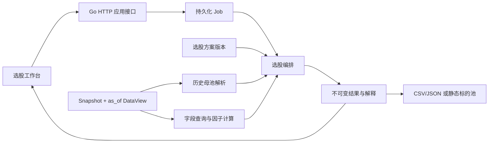

# 选股功能设计

版本：0.1。日期：2026-09-12。状态：Proposed，待实施。

本轮只提供设计文档。本文中的接口、数据结构、页面和工作包均为建议，尚未加入现有 OpenAPI、Go 服务或前端；不能据此声称选股功能已可运行。

## 1. 目标与边界

提供独立的选股工作台：用户选择标的范围和数据时点，通过行情、估值、财务与因子条件筛选股票，再按指标或组合评分排序，得到可以解释、保存、导出和复现的候选名单。

典型流程：

**选择数据快照与标的池 → 配置筛选条件 → 配置排序/评分 → 预检 → 执行 → 查看入选与排除原因 → 保存名单或交给策略研究。**

选股不要求先创建交易策略，也不依赖初始资金、费用或撮合模型。名单不包含下单指令；选入不等于已验证可成交，仓位、调仓、风控和交易成本仍由策略与回测模块处理。

### 1.1 首期能力

| 编号 | 能力 | 范围 |
| --- | --- | --- |
| SCREEN-01 | 选股方案 | 新建、复制、保存不可变版本；包含条件、排序、评分与结果列 |
| SCREEN-02 | 条件筛选 | 数值、枚举、布尔、区间、集合及 AND/OR/NOT 嵌套组合 |
| SCREEN-03 | 因子选股 | 引用已注册因子版本与参数，复用 DataView 和因子计算能力 |
| SCREEN-04 | 排名与数量 | 多字段排序或多因子加权评分；可取前 N 个或全部满足条件的标的 |
| SCREEN-05 | 时点与预检 | 固定快照、历史标的池和决策时点，校验数据、单位、频率及历史长度 |
| SCREEN-06 | 结果与解释 | 入选值、排序/评分依据、排除原因、数据时间、历史运行对比 |
| SCREEN-07 | 成果衔接 | 保存静态标的池、导出 CSV/JSON；保留来源运行和时点证据 |
| SCREEN-08 | 界面与任务 | 全部首期操作在界面完成；复用 Job 的进度、取消、重试与恢复 |

这些是新增设计 ID，尚未并入主需求基线与自动化追踪。正式实施时应同步更新主需求、契约和实施矩阵。

### 1.2 后续扩展

定时选股、实时行情扫描、入选/移除提醒、行业配额、复杂优化、自然语言转条件、区间内每日名单与换手分析，可在后续阶段扩展。首期采用用户手动发起单时点计算，不自动订阅实时行情、不发送外部通知。

首期市场、资产覆盖、供应商和主要频率沿用既有决策门禁，未因“选股”一词自动选择 A 股或某家供应商。界面只展示所选股票数据集实际支持的字段；其他资产通过后续能力声明扩展。

## 2. 与现有模块的关系

| 对象/模块 | 职责 | 与选股的边界 |
| --- | --- | --- |
| UniverseVersion | 确定研究母池及历史成分 | 输入标的范围，不承担所有筛选与评分逻辑 |
| DataView | 在固定快照和时点查询可见数据 | 所有筛选、排序、展示值均从受控视图取得 |
| Factor registry/engine | 计算指标和因子、校验依赖 | 选股引用已有能力，不另建一套 PE、动量和波动率公式 |
| ScreenerVersion | 保存可重复使用的选股规则 | 是方案，不是当天名单 |
| ScreenRun | 保存一次运行的冻结输入和证据 | 同一方案换日期或快照运行，创建新 Run |
| ScreenResult | 保存排序结果与解释 | 是某时点事实，不随数据更新而改变 |
| Strategy / Backtest | 仓位、调仓、成交、费用及绩效 | 可消费选股规则/名单，但不由选股直接生成交易或收益结论 |
| Job / Artifact | 任务生命周期与文件发布 | 复用现有机制，不另建内存任务队列或独立文件协议 |

继续采用 Go 模块化单体。未来可按计算量拆分 Worker，选股应用接口保持稳定。建议实现边界为 `internal/screening` 的规则与计算服务；HTTP、持久化和页面接入沿用仓库当前目录与注册方式，不为选股创建独立微服务。



## 3. 使用场景与数据需求

| 场景 | 条件或排序例子 | 必需数据 | 注意事项 |
| --- | --- | --- | --- |
| 基础过滤 | 市场、行业、上市年限、停牌/风险状态 | instrument、calendar、历史 membership、trading_status | 判断历史状态，不能使用今日状态回填 |
| 估值筛选 | PE_TTM、PB、市值、股息率 | 历史 valuation、share_capital、价格；必要时财报 | 口径、币种、单位和非正分母政策明确 |
| 财务筛选 | ROE、营收增长、现金流、负债率 | 三大财报或版本化财务指标、公告与修订 | 报告期不等于可用时间 |
| 量价筛选 | 价格区间、成交额、换手、放量 | OHLCV、amount、股本、日历 | 零成交、缺行情和停牌分开 |
| 技术筛选 | 均线位置、突破、N 期涨幅、波动率 | K 线、公司行为/复权、因子计算 | 预热长度、频率、完成 Bar 和价格口径固定 |
| 综合排名 | 低估值、高盈利质量、低波动的组合分数 | 所引用指标/因子的完整依赖 | 各分量方向、变换、权重和排名母体固定 |

完整数据字段与供应商候选沿用 [因子与数据源清单](factor-data-catalog.md)。接入层负责单位换算，选股层不直接绑定供应商私有字段。

每个可选字段向页面提供：字段 ID、中文名称、类型、单位、所属数据集/因子、适用资产、支持操作符、可用历史、最大陈旧度、因子参数 schema。历史快照没有的字段应显示不可用及原因，不能通过填充当前值启用。

以下是交互表达例子，不是默认参数或投资建议：

```text
全部满足：
  PE_TTM > 0
  PE_TTM < 用户设置的上限
  ROE >= 用户设置的下限
  以下至少一个满足：
    N 期收益 > 用户设置的阈值
    成交额均值 > 用户设置的阈值

按用户选择的指标与方向排序，取前 N 个。
```

ROE、换手等比例在 API 中使用小数；页面可显示百分数并清楚转换。PE/PB 显示倍数，市值/成交额显示币种与数量级，价格比较不得隐式跨币种。

## 4. 条件、排序与评分语义

### 4.1 条件树

使用有类型的条件树，不接收 SQL、Go 源码或任意脚本。节点 ID 在版本内唯一，用于逐条件解释与错误定位。

| 节点 | 结构 | 规则 |
| --- | --- | --- |
| 逻辑组 | `all` / `any` + children | 分别对应 AND / OR，子节点不能为空 |
| 否定 | `not` + child | 恰好一个子节点，遵守下述未知值语义 |
| 比较 | input、operator、typed value | `eq/ne/gt/gte/lt/lte`，按输入类型限制 |
| 区间 | input、lower、upper、边界包含标识 | 校验下界不大于上界；端点开闭显式 |
| 集合 | input、`in/not_in`、typed values | 首期用于枚举、字符串或数值集合 |
| 缺失检测 | input、`is_missing/is_present` | 显式检测数据状态，不将数值 0 视为缺失 |

`input` 引用原始字段或某个因子绑定。参数化因子通过绑定 ID 区分，例如同一动量因子的两个窗口是两个绑定，不能仅按 factor_id 合并缓存或解释。

历史交叉、突破和增长等时序计算由已注册因子提供；选股比较节点只比较时点值，避免另外实现一套 lookback 和时间规则。树深、节点数、集合长度和执行预算有服务端上限，在预检时返回，不写死未经容量验证的数字。

### 4.2 缺失与三值逻辑

普通比较结果为 `true / false / unknown`。缺失、过期、窗口不足、无效分母不能自动变成 0，也不能因 `NOT` 而进入名单。

- `NOT unknown = unknown`。
- AND：存在 false 则为 false；全部 true 才为 true；其余为 unknown。
- OR：存在 true 则为 true；全部 false 才为 false；其余为 unknown。
- 仅整个条件树为 true 的标的进入排名候选集。若 OR 已因另一个条件为 true，允许进入，但仍显示未满足数据条件的分支说明。
- `is_missing/is_present` 返回确定布尔值，允许研究者显式研究缺失状态；不允许借此绕过严格 PIT 的整体数据证据检查。
- 整个必要数据集/字段不存在、频率不支持或严格 PIT 不满足属于预检阻塞；个别标的缺失按规则解释和计数。
- 页面展示用的附加列缺失只显示原因；如果该列也是条件或排名输入，则执行相应严格规则。

运行配置保存 `required_value_policy`：`exclude_instrument` 或 `fail_run`，无隐式默认。前者排除无法判定/排名的标的并计数；后者遇到必要输入未知且无法确定入选或排名时使运行失败。仅作为展示的列不触发 fail_run。

### 4.3 排序

首期支持两种互斥模式：

1. **多字段排序**：按用户排列的字段优先级依次升序/降序比较。
2. **综合评分**：先计算分数再降序，允许增加明确的第二排序键。

最终总是追加 `instrument_id` 升序作为稳定决胜键，不依赖数据库扫描顺序。缺少必要排名值的标的不进入排序；不隐式置顶、补零或按剩余因子重分配权重。

`selection` 明确为 `all` 或 `top_n`。top_n 要求 N 为正整数；不足 N 时返回全部合格标的，不补入不合格标的。恰好边界同分时按稳定键选足 N 个；“同分全部纳入”属于以后新增的显式政策。

结果页临时调整展示排序只改变已冻结名单的排列，不改变入选成员和正式 rank；修改选股排序或 N 必须创建新方案版本与新运行。

### 4.4 综合评分

首期采用明确的百分位排名加权，不同时引入多种不透明归一化算法：

1. 对所有硬条件通过且各评分输入完整的股票构建同一评分母体。
2. 对每个分量按原始值升序取平均秩 `r`；母体大小为 `m`。`m > 1` 时 `p=(r-1)/(m-1)`；`m=1` 时令 p=0.5。
3. 越大越好使用 p，越小越好使用 `1-p`；全体相等时均为 0.5。
4. 权重非负且总和为 1；页面可以辅助归一化，但服务端要求提交明确的归一化权重。所有权重都为 0 时拒绝。
5. `score = Σ(weight × directed_percentile)`，保存每个原始值、百分位、权重和贡献。

评分政策必须有版本，固定比较精度、相等判断、舍入与累加顺序。确定性是数值政策的契约；不能用界面显示的小数位判断并列。行业中性化、组内排名和行业名额属于后续显式扩展。

因子本身若包含横截面 rank/zscore，其母体仍由该因子的契约决定；本模块的评分百分位母体另行记录，二者不得混淆。优化时不能把硬条件提前下推到因子横截面计算前而悄悄改变因子值。

## 5. 时间、快照与历史选股

每次运行必须绑定 `snapshot_id + universe_ref + as_of + decision_timezone`。`as_of` 是决策时刻，界面同时显示所属时区与实际数据截止时间。

- 只读 `available_at <= as_of` 的数据；修订、成分与状态均按历史有效性解析。
- 筛选用 K 线必须已经结束且在该时点可用，不能使用未来完成的日 K/分钟 K。多频率输入各自绑定频率和历史窗口，不混成一个隐含频率。
- 财务及低频字段必须按声明的历史可用性和最大陈旧度匹配，不能无限向前填充。
- “使用最新数据”是界面便捷动作：先明确解析为一个已经发布的快照和决策时点，预检展示后再提交；冻结输入后 Worker 不再次解析 latest。
- 缺失最新一日时不自动退到更早日期并仍显示今天；允许选择较早快照，但必须显式展示实际覆盖与陈旧性。
- 相同方案、快照和时点重跑应得到相同名单、排名及解释。未来更新生成新运行，不覆盖旧结果。

严格模式拒绝未经验证的 PIT 证据；如启用既有探索模式，警示必须随名单、静态池及导出持续保留，不能通过成果转换抹除。

## 6. 领域对象与计算流程

### 6.1 主要对象

| 对象 | 必备字段 | 生命周期 |
| --- | --- | --- |
| ScreenerVersion | id/version、parent_id、name、description、input_bindings、condition_tree、ranking、selection、display_columns、规则 schema version | 新建版本，不覆盖已保存方案 |
| ScreenRunRequest | screener_ref、snapshot_id、universe_ref、as_of、decision_timezone、strict_pit、required_value_policy、source_run_id（可选） | 提交时冻结，source_run_id 用于重跑追踪 |
| ScreenRun | id、job_id、冻结 request、build/engine/policy 版本、config/snapshot hash、created_at、result refs | Job 管进度；Run 管研究输入和结果 |
| ScreenRow | instrument_id、历史代码/名称、是否入选、rank、score（排序模式可为空）、指标值、原因摘要、quality_flags | 终态不可变；代码/名称来自同一历史视图 |
| ScreenExplanation | 每个条件的输入、阈值、true/false/unknown、原始数据时间/修订引用；评分分项；排除阶段 | 可按标的查询，避免列表携带超大解释树 |
| ScreenSummary | 母池数量、硬条件排除数、未知数、排名数据不足数、可排名数、入选数、未入选数、空结果原因 | 相同定义应用于页面和导出 |

空历史母池或合法规则筛出 0 个股票是 `succeeded` 的空结果，不伪装为系统失败。依赖缺失、非法规则、计算或发布失败仍是错误。复用因子预检时需区分“无需计算的空母池”和“缺失输入”，避免机械套用拒绝空因子任务的规则。

计数按固定阶段互斥归类：母池 = 硬条件 false + 条件 unknown + 条件 true；条件 true = 排名数据不足 + 可排名；可排名 = 入选 + 未入选。多条失败条件可全部列出，但汇总不能将同一个股票重复计数。fail_run 模式没有可交付的成功名单。

### 6.2 执行顺序

1. 加载方案版本并校验绑定、类型、单位、操作符、评分和输入可用性。
2. 冻结研究上下文；提交持久化 Job，预分配 Run ID。
3. 从同一 DataView 解析历史母池，建立所需因子及字段依赖计划。
4. 按因子声明的完整横截面和历史窗口计算，再逐标的执行条件树；保留缺失与不通过解释。
5. 建立完整评分/排序母体，计算排名，再应用 all/top_n。
6. 输出完整结果与汇总，按现有 Artifact 协议暂存、校验并原子发布。
7. 以租约/fencing 和取消状态保护终态；取消先受理后不发布成功结果。

长计算分片执行，但全局排序/百分位不能按分片分别计算后直接拼接。内存不足可外部排序；结果必须与同政策的单批次计算一致。缓存键包含方案哈希、参数绑定、快照、母池、as_of、严格/缺失政策和引擎版本。

## 7. Go 接口建议

以下仅为设计签名。类型语义由上表及本节定义，正式实施时再放入合适的领域与端口包并验证编译，不直接修改当前草案文件。

```go
// ScreenerRegistry 管版本化方案，应用服务负责工作区授权。
type ScreenerRegistry interface {
    CreateVersion(ctx context.Context, def ScreenerDefinition) (ScreenerVersion, error)
    GetVersion(ctx context.Context, ref VersionRef) (ScreenerVersion, error)
    List(ctx context.Context, query ScreenerListQuery) (ScreenerPage, error)
}

// 引擎负责计算；运行由现有 JobService 编排。
type ScreeningEngine interface {
    Preflight(ctx context.Context, req ScreenRunRequest) (ScreenPreflight, error)
    Run(ctx context.Context, req ScreenRunRequest, sink ProgressSink) (ScreenResult, error)
}

// 结果仓储不对外暴露数据库或磁盘路径。
type ScreenResultReader interface {
    GetRun(ctx context.Context, runID ID) (ScreenRun, error)
    ListRows(ctx context.Context, query ScreenRowsQuery) (ScreenRowsPage, error)
    Explain(ctx context.Context, runID ID, instrumentID ID) (ScreenExplanation, error)
}

type ScreenOutputService interface {
    CreateStaticUniverse(ctx context.Context, req ScreenUniverseRequest) (UniverseVersion, error)
    Export(ctx context.Context, req ScreenExportRequest) (Artifact, error)
}
```

- `ScreenerDefinition` 为不含服务端 ID 的方案创建输入；`ScreenerListQuery/Page` 沿用现有分页约定。
- `ScreenPreflight` 返回 valid、Issues、依赖覆盖和扫描量估计，不创建 Job。
- `ScreenResult` 包含 Summary 和产物引用；发布成功前不可查询为完成结果。
- `ScreenRowsQuery` 包含 run_id、入选状态筛选、q、cursor、limit；页面查询只作用于已冻结结果。
- `ScreenUniverseRequest` 包含成功 run_id、新池名称与幂等键，首期保存全部入选成员；手动改名单是另外的静态池版本。
- `ScreenExportRequest` 包含 run_id、明确的成员范围和 format，支持 CSV/JSON，执行前检查原始数据导出许可。

实现不得把数据库访问、网络抓取或未受控时钟传给条件求值器；底层数据和因子通过已有端口供给。首期无需新增生产依赖。

## 8. HTTP 接口建议

拟使用 `/api/v1` 前缀。下表是待纳入 OpenAPI 的候选契约，并非当前服务已支持的接口。

| 方法 | 相对路径 | 请求/响应与用途 |
| --- | --- | --- |
| GET | `/screeners` | 分页返回 ScreenerVersion 摘要，支持名称搜索 |
| POST | `/screeners` | 提交 ScreenerDefinition，201 返回新的 ScreenerVersion |
| GET | `/screeners/{id}` | 读取指定不可变版本，不自动跳到最新版本 |
| POST | `/screen-runs/preflight` | ScreenRunRequest → 200 ScreenPreflight；valid=false 不允许执行 |
| POST | `/screen-runs` | ScreenRunRequest → 202 Job，Location 指向任务；后台重新预检 |
| GET | `/screen-runs` | 按方案版本、时点、任务状态分页查询历史运行 |
| GET | `/screen-runs/{id}` | 返回冻结配置、job_id、summary、manifest 与产物状态 |
| GET | `/screen-runs/{id}/rows` | 分页结果；可筛选入选/排除，返回列 schema、单位与原因摘要 |
| GET | `/screen-runs/{id}/explanations/{instrument_id}` | 返回单标的条件树和评分证据；不在该次母池中则返回 404 |
| POST | `/screen-runs/{id}/universe` | 保存全部入选成员为新的静态 UniverseVersion，201 返回资源 |
| POST | `/screen-runs/{id}/exports` | 提交 `{scope, format}`，202 返回导出 Job；scope 明确 selected/all_candidates |

任务进度、取消、失败重试复用 `/jobs/{id}` 相关接口；导出完成后复用 Artifact 下载接口。成功运行重跑时用原配置再次 POST `/screen-runs` 并填 source_run_id；不能把成功 Run 当失败 Job retry。

### 8.1 返回与错误约定

- 写操作沿用现有鉴权、工作区隔离、Idempotency-Key 和 request_id；只读 preflight 不要求幂等键。
- `VersionRef` 使用现有精确版本引用语义；方案变更创建新版本，历史运行保持原引用。
- 行列表采用服务端分页，默认正式 rank 升序、稳定键 instrument_id；排除行 rank 为 null，并显式排序到入选/可排名行之后。筛选/search/展示排序的改变必须绑定新游标上下文，不重算名单。
- 结果发布前访问 rows/explanation/materialization/export 返回 409 `result_not_ready`；GET Run 和 Job 仍可查看状态。
- 空结果的 rows 返回成功空数组，export 可生成表头及空结果说明；创建静态池时返回 422 `empty_selection`，不能无提示产生无成员池。
- 结构/类型错误返回 400；预检与业务条件失败返回 422；未知版本 404；幂等/终态冲突 409；权限 401/403。
- 运行错误沿用标准 Error + Issues，定位到 condition node ID、input binding 或 ranking component，前端能聚焦对应配置项。

### 8.2 当前契约的衔接事项

1. 现有 Expression 支持的操作符少于本文的条件树，不能直接发送新操作符并声称兼容。实施时新增独立 `ScreenCondition`/`ScreenInput` schema，复用已有因子引用和 Value；避免直接扩大所有策略表达式的权限。
2. 现有 Job.result_refs 的枚举没有 screen_run；若采用该值，需要同步生成器、JSON、Go DTO/处理及 TypeScript 类型，审查旧消费者的未知枚举处理。
3. 现有 Experiment.kind 没有筛选运行。首期由 ScreenRun 独立保存研究证据，不修改该枚举；统一实验中心作为后续显式兼容变更。
4. 静态 UniverseVersion 需要新增可选来源元信息：source_screen_run_id、as_of、snapshot hash、质量限制；保留已有 static 创建方式。
5. 现有 `/exports` 未包含选股结果类型，本设计先采用独立选股导出入口，底层仍复用任务与产物服务，不悄悄更改既有导出枚举。
6. 契约文档与当前实现的共享语义差异（游标错误状态、幂等键过期行为）已按 ADR-0005 统一：游标 400 结构非法 / 422 `pagination.cursor_expired` 超期，幂等过期键 409 `idempotency.key_expired` 且不悄悄再次执行。选股 handler 通过共享分页与幂等中间件继承同一套语义及测试，不引入第三套规则。

## 9. 界面操作设计

沿用 [界面需求](frontend.md) 与 [DESIGN.md](../DESIGN.md) 的 React 工作台、ResearchContextBar、SchemaForm、PagedTable、IssueList 和 JobStatus 约定。

### 9.1 页面结构

| 页面 | 内容与操作 |
| --- | --- |
| 选股方案 `/screeners` | 列表、搜索、新建、基于旧版本复制、查看运行记录 |
| 方案编辑 `/screeners/new` | 选择输入、条件树、排序/评分、数量、展示列；保存新版本 |
| 方案详情 `/screeners/:id` | 只读版本配置、依赖说明、选择快照/母池/as_of、预检、运行 |
| 运行详情 `/screen-runs/:id` | 冻结上下文、任务进度、结果表、排除统计、解释抽屉、保存池与导出 |

编辑工作区建议布局：顶部研究上下文；左侧条件组；中部排序/评分与结果列；底部预检问题及运行操作。结果页以表格为主，详情抽屉展示逐条件证据；不需要单独制作营销式首页。

### 9.2 一次完整操作

1. 选择或新建方案，添加所需数据字段/因子；单位和参数直接显示。
2. 使用“全部满足 / 任一满足 / 不满足”组织条件，分组缩进可见；键盘和按钮可完成全部操作，不强制拖拽。
3. 选择多字段排序或综合评分，设置方向、权重、取前 N 个/全部。
4. 保存方案版本，再明确快照、母池、决策时点和缺失政策；保存方案不触发计算。
5. 点击预检，查看缺数据、窗口不足、类型/单位错误和预计规模；必要字段不可用时回链数据中心。
6. 点击运行进入结果页，离开页面或刷新后从 Job 恢复；请求取消期间显示“正在取消”。
7. 查看入选表及“未入选 / 数据不足 / 条件不满足”结果，点击股票查看规则和评分明细。
8. 保存为静态标的池，或导出；“重新运行”产生新结果，旧结果保持可查看。

### 9.3 表格与异常状态

结果列至少包括排名、证券代码/名称、筛选与排名关键值、综合得分（适用时）、数据截止时间和质量状态。支持列选择、分页、搜索、排序；这些显示偏好与改变选股成员的规则明确分开。

所有页面覆盖加载、首次空态、搜索无结果、筛选 0 个、部分字段缺失、失败、无权限、断线、取消及过期游标。0 个结果解释是母池为空、条件过严还是排名输入不足，并提供定位入口；不擅自放宽条件。

表单修改未保存时提示离开风险，失败保留输入，重复点击由界面与服务端幂等共同处理。支持中文输入法、键盘焦点、窄视口局部表格滚动；字段错误和收益方向不只依赖颜色。

## 10. 与策略和回测的衔接

用户补充的“逐日推进历史、自己决定买卖”见 [历史选股与手动模拟交易设计](historical-replay-trading-design.md)。该模式复用本模块的时点选股结果，通过独立 ReplaySession 接受人工委托；不要求先创建自动交易策略，也不把独立选股任务扩展成交易账户。

### 10.1 保存静态名单

从成功 ScreenRun 生成独立 UniverseVersion，保存全部入选 instrument_id 以及来源快照、as_of 和质量限制。生成后的池不会每日自动更新；方案与静态池分别展示，避免“保存方案”与“保存名单”混淆。

由 t 时刻选股生成的静态池，不能当作 t 之前已经知道的历史标的池。首期回测预检应拒绝将这类池用于早于其 selection as_of 的决策，避免产生隐蔽未来信息。过去历史价格可用于 t 时刻的预热，但不能在 t 之前生成交易决策或评价为无偏回测。

### 10.2 动态规则衔接

以后支持在每个策略调仓时点重新执行同一 ScreenerVersion，使用当时的 DataView 和历史母池，输出候选集再交给仓位构建。此时选股规则随策略版本固定，不能复用最终日期的名单回填整个回测区间。

动态运行与独立工作台共享条件/排名引擎；调仓日历、资金、交易资格和成本由策略/市场模型管理。首期仅定义此边界，不新增动态 Universe 类型或下单接口。

## 11. 持久化、兼容性与实施顺序

建议新增 screener_versions、screen_runs 元数据，结果和解释按现有 Artifact 机制保存；大结果不全部塞进 JobEvent 或元数据 JSON。索引覆盖工作区、方案版本、as_of、run_id 与终态查询。具体迁移编号在实施时根据现有迁移序列分配，本轮不预占编号。

所有查询与导出执行现有工作区授权；路径由 artifact_id 解析，不接受浏览器传入服务器磁盘路径。导出 CSV 对来自外部数据的文本做公式注入防护，并保存准确数值、单位和时点元信息；金融精度不由电子表格自动推断决定。

旧方案和结果不可原地修改。规则 schema 变化需版本解析器；无法识别的操作符或政策拒绝运行，不自动降级。生产依赖、权限或部署配置变更另走既有决策流程。

| 切片 | 交付 | 依赖 |
| --- | --- | --- |
| S1 契约与纯规则 | 正式 schema、类型、三值逻辑、稳定排序/评分、合成用例 | 现有领域与契约基础；不要求真实市场 |
| S2 数据与任务 | PIT/Universe/Factor 适配、Job、结果持久化和恢复 | 数据视图、母池解析、所需因子已可用 |
| S3 页面闭环 | 保存方案→预检→执行→结果/解释→导出 | S1/S2 业务 API 已验证 |
| S4 静态池衔接 | 来源元信息、保存静态池、回测时点校验 | Universe 持久化；回测接入时落实预检 |
| 后续 | 定时、动态规则、区间名单、统一实验对比 | 单独确认范围与兼容设计 |

真实市场验收沿用 DEC-01/02；不能因为新增文档就把数据、因子或现有 M0 工作包标成完成。本设计可作为 M1 因子/标的池之后的增量工作包；PIT 和基础选择规则可以先用合成样本验证。

## 12. 验收场景

| ID | 场景 | 必须成立的结果 |
| --- | --- | --- |
| SC-AC-01 | 数值/区间/集合与嵌套 AND/OR/NOT | 边界、类型及真值表符合定义；非法单位和操作符预检拒绝 |
| SC-AC-02 | PE 为空、负盈利、缺历史、过期值、NOT unknown | 空值不当 0；未知不被否定变成 true；负盈利按明确条件处理 |
| SC-AC-03 | 修改 as_of 之后的财报、行情、成分与状态 | 过去名单、排名、解释不变 |
| SC-AC-04 | 多字段同值、评分分量同值、不同分片和分页 | 全局排名与 top_n 成员一致，instrument_id 决胜稳定 |
| SC-AC-05 | 母体只有 1 个、全部同值、权重和非法、缺少评分值 | 百分位符合 0.5 规则；非法权重拒绝；缺分量不重新分权 |
| SC-AC-06 | 0 个结果、不足 N、附加展示列缺失 | 正确成功空态/少量结果；不补入不合格标的、不因展示缺失任意排除 |
| SC-AC-07 | 保存方案后换快照或日期再次运行 | 新 Run，旧配置/结果不可变；方案和静态名单语义清楚 |
| SC-AC-08 | 并发提交、取消竞争、Worker 重启、旧租约发布 | 复用 Job 保证幂等和原子终态，半成品不作为成功结果 |
| SC-AC-09 | 使用完整名单保存池、使用搜索过滤后的列表导出 | scope 明确；不把当前页面当完整名单；导出与持久化结果一致 |
| SC-AC-10 | t 时点名单用于 t 前的回测决策 | 拒绝并说明选择时点，不能回填历史；探索质量限制不丢失 |
| SC-AC-11 | 页面成功、预检失败、断线、键盘、窄视口 | 无手写 JSON 也能完成闭环；失败保留配置、空结果有原因 |
| SC-AC-12 | 切换工作区、越权解释/下载、过期游标 | 按统一鉴权与分页规则拒绝，不泄露其他结果 |

本轮只验证文档引用和设计一致性；上述 SC-AC 场景待功能实施，不代表已通过测试。

## 13. 参考依据与待确认项

TradingView 将筛选条件、排序和显示列保存为可复用方案，这支持本设计将方案配置与某次结果分离。本文不沿用其删除或覆盖行为，项目已有不可变版本约束优先。[官方方案保存说明](https://www.tradingview.com/support/solutions/43000718804-how-to-create-save-and-update-a-custom-screen/)

QuantConnect 的基本面母池示例展示了按基本面条件过滤并排序选择标的；其文档也提示排序前排除 NaN。本文借鉴“过滤→排序→选取”的职责拆分，并进一步按项目要求明确三值逻辑、缺失原因与历史时点约束。[基本面母池](https://www.quantconnect.com/docs/v2/writing-algorithms/algorithm-framework/universe-selection/fundamental-universes)、[基本面数据与空值](https://www.quantconnect.com/docs/v2/writing-algorithms/universes/equity/fundamental-universes)

上述来源用于设计比较，不构成对这些平台当前数据权限、具体市场规则或供应商覆盖的承诺，没有复制外部实现代码。

实施前仍需确认：首期市场/股票范围、主要频率、真实数据源、首批开放指标及规模上限。用户实际筛选阈值、排名权重和取股数量由每个方案显式配置，本设计不替用户预设。
